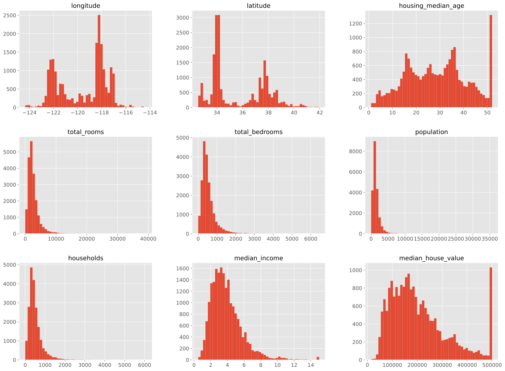
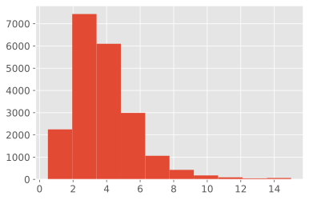
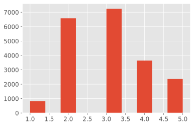
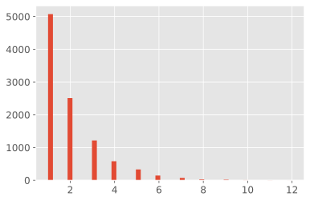
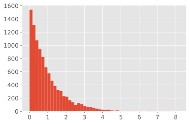
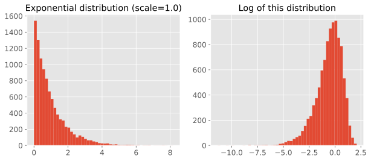
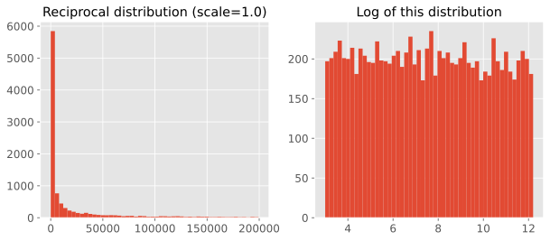

# 2. 端到端的机器学习项目

## 大局观
一个端到端的机器学习项目经历的步骤主要:

1. 观察大局
2. 获得数据
3. 从数据探索和可视化中获得洞见
4. ML算法的数据准备
5. 选择和训练数据
6. 微调模型
1. 展示解决方案
1. 启动、监控和维护数据

**使用真实的数据**

- 流行的开放数据存储库
    - [UC Irvine Machine Learning Repository](http://archive.ics.uci.edu/ml/index.php)
    - [Kaggle datasets](https://www.kaggle.com/datasets)
    - [Amazon's AWS datasets](https://aws.amazon.com/fr/datasets)
- 元门户点
    - http://dataportals.org/
    - http://opendatamonitor.eu/
    - http://quandl.com/
- 其他一些列出许多流行的开放数据存储库的地址
    - [维基百科ML datasets](https://goo.gl/SJHN2k)
    - [Quora.com question](https://goo.gl/zDR78y)
    - [Datasets subreddit](https://www.reddit.com/r/datasets)


**知识点：**
- 一种常见的分布是呈钟形态的分布，称为正态分布（也叫高斯分布），“68-95-99.7”的规则是指：大约68%的值落在$1\sigma$内，95%落在$2\sigma$内，99.7%落在$3\sigma$内
- 当数据有很多离群区域时，可以考虑使用**平均绝对误差-MSE**代替**均方根误差-RMSE**
- 均方根误差-RMSE对应欧几里得范数，也称为$l_2$范数，记作$||.||_2$
- 平均绝对误差-MSE对应$l_1$范数，记作$||.||_1$，有时也被称为**曼哈顿距离**
- 范数指数越高，越关注大的价值，忽视小的价值。这就是为什么RMSE比MAE对异常值更敏感的原因。当异常值非常稀少（例如钟形曲线）时，RMSE的表现优异，通常作为首选。
- 我们在很多设置随机种子的代码中，都会看到`np.random.seed(42)`，其中的42数字并没有特殊属性，只是“关于生命、宇宙和一切终极问题的答案”而已（来自《银河系搭车客指南》）
- 使用[`sklearn.model_selection.StratifiedShuffleSplit`](https://scikit-learn.org/stable/modules/generated/sklearn.model_selection.StratifiedShuffleSplit.html)进行分层抽样
- 使用`sklearn.preprocessing.LabelBinarizer`一次完成`sklearn.preprocessing.LabelEncoder`和`sklearn.preprocessing.OneHotEncoder`的操作
- 使用`pandas.plotting.scatter_matrix`绘制相关矩阵图


## 创建测试集
**数据窥探偏误(data snooping bias)**: 大脑是一个非常神奇的模式检测系统，也就出说它很容易过拟合：如果你本人浏览测试数据集，你很可能会跌入某个看似有趣的数据模式，进而选择某个特殊的机器学习模型。然后再使用模型对泛化误差率进行估算的时候，估计结果将会过于乐观。

## 代码


```python
# To support both python 2 and python 3
from __future__ import division, print_function, unicode_literals

# Common imports
import numpy as np
import os

# to make this notebook's output stable across runs
np.random.seed(42)

# To plot pretty figures
%matplotlib inline
import matplotlib as mpl
import matplotlib.pyplot as plt
mpl.rc('axes', labelsize=14)
mpl.rc('xtick', labelsize=12)
mpl.rc('ytick', labelsize=12)

# Where to save the figures
import os
PROJECT_ROOT_DIR = os.getcwd()
IMAGES_PATH = os.path.join(PROJECT_ROOT_DIR, "images")

def save_fig(fig_id, tight_layout=True, fig_extension="png", resolution=300):
    path = os.path.join(IMAGES_PATH, fig_id + "." + fig_extension)
    print("Saving figure", fig_id)
    if tight_layout:
        plt.tight_layout()
    plt.savefig(path, format=fig_extension, dpi=resolution)

# Ignore useless warnings (see SciPy issue #5998)
import warnings
warnings.filterwarnings(action="ignore", message="^internal gelsd")
```

## 获取数据集


```python
# 使用tqdm定义一个可以在notebook中使用的进度条指示器
from tqdm import tqdm, tqdm_notebook
def progress_hook(t):
    """
    封装一个tqdm实例。当结束的时候不要忘了调用close()或者__exit__()，最简单的方法是使用with语法

    示例
    -------

    >>> with tqdm() as t:
    ...     reporthook = my_hook(t)
    ...     urllib.urlretrieve(..., reporthook=reporthook)    

    """
    last_b = [0]

    def inner(b=1, bsize=1, tsize=None):
        """
        b   : int, optional
              已经处理的blocks的数量，默认为1
        bsize   : int, optional
                    每个block的大小（以tqdm的单位计算）， 默认为1
        tsize   : int, optional
                    总共的size（tqdm单位），默认为None，表示不变
        """
        if tsize is not None:
            t.total = tsize
        t.update((b - last_b[0]) * bsize)
        last_b[0] = b
    return inner
```


```python
import os
import tarfile
from urllib import request

#DOWNLOAD_ROOT = "https://raw.githubusercontent.com/ageron/handson-ml/master/"
# 为了在内网下面可以测试
DOWNLOAD_ROOT = "https://shawnzhang31.com/opencv-learning/bundle3/"
HOUSING_PATH = os.path.join("datasets", "housing")
HOUSING_URL = DOWNLOAD_ROOT + "datasets/housing/housing.tgz"

def fetch_housing_data(housing_url=HOUSING_URL, housing_path=HOUSING_PATH):
    os.makedirs(housing_path, exist_ok=True)
    tgz_path = os.path.join(housing_path, "housing.tgz")
    with tqdm(unit='B', unit_scale=True, leave=True, miniters=1) as t:
        request.urlretrieve(housing_url, tgz_path, reporthook=progress_hook(t), data=None)
    housing_tgz = tarfile.open(tgz_path)
    housing_tgz.extractall(path=housing_path)
    housing_tgz.close()
```


```python
fetch_housing_data()
```

    410kB [00:02, 156kB/s]                           


```python
import pandas as pd

def load_housing_data(housing_path=HOUSING_PATH):
    csv_path = os.path.join(housing_path, "housing.csv")
    return pd.read_csv(csv_path)
```


```python
housing = load_housing_data()
housing.head()
```


<div>
<style scoped>
    .dataframe tbody tr th:only-of-type {
        vertical-align: middle;
    }

    .dataframe tbody tr th {
        vertical-align: top;
    }

    .dataframe thead th {
        text-align: right;
    }
</style>
<table border="1" class="dataframe">
  <thead>
    <tr style="text-align: right;">
      <th></th>
      <th>longitude</th>
      <th>latitude</th>
      <th>housing_median_age</th>
      <th>total_rooms</th>
      <th>total_bedrooms</th>
      <th>population</th>
      <th>households</th>
      <th>median_income</th>
      <th>median_house_value</th>
      <th>ocean_proximity</th>
    </tr>
  </thead>
  <tbody>
    <tr>
      <th>0</th>
      <td>-122.23</td>
      <td>37.88</td>
      <td>41.0</td>
      <td>880.0</td>
      <td>129.0</td>
      <td>322.0</td>
      <td>126.0</td>
      <td>8.3252</td>
      <td>452600.0</td>
      <td>NEAR BAY</td>
    </tr>
    <tr>
      <th>1</th>
      <td>-122.22</td>
      <td>37.86</td>
      <td>21.0</td>
      <td>7099.0</td>
      <td>1106.0</td>
      <td>2401.0</td>
      <td>1138.0</td>
      <td>8.3014</td>
      <td>358500.0</td>
      <td>NEAR BAY</td>
    </tr>
    <tr>
      <th>2</th>
      <td>-122.24</td>
      <td>37.85</td>
      <td>52.0</td>
      <td>1467.0</td>
      <td>190.0</td>
      <td>496.0</td>
      <td>177.0</td>
      <td>7.2574</td>
      <td>352100.0</td>
      <td>NEAR BAY</td>
    </tr>
    <tr>
      <th>3</th>
      <td>-122.25</td>
      <td>37.85</td>
      <td>52.0</td>
      <td>1274.0</td>
      <td>235.0</td>
      <td>558.0</td>
      <td>219.0</td>
      <td>5.6431</td>
      <td>341300.0</td>
      <td>NEAR BAY</td>
    </tr>
    <tr>
      <th>4</th>
      <td>-122.25</td>
      <td>37.85</td>
      <td>52.0</td>
      <td>1627.0</td>
      <td>280.0</td>
      <td>565.0</td>
      <td>259.0</td>
      <td>3.8462</td>
      <td>342200.0</td>
      <td>NEAR BAY</td>
    </tr>
  </tbody>
</table>
</div>


```python
housing.info()
```

    &lt;class &#39;pandas.core.frame.DataFrame&#39;&gt;
    RangeIndex: 20640 entries, 0 to 20639
    Data columns (total 10 columns):
     #   Column              Non-Null Count  Dtype  
    ---  ------              --------------  -----  
     0   longitude           20640 non-null  float64
     1   latitude            20640 non-null  float64
     2   housing_median_age  20640 non-null  float64
     3   total_rooms         20640 non-null  float64
     4   total_bedrooms      20433 non-null  float64
     5   population          20640 non-null  float64
     6   households          20640 non-null  float64
     7   median_income       20640 non-null  float64
     8   median_house_value  20640 non-null  float64
     9   ocean_proximity     20640 non-null  object 
    dtypes: float64(9), object(1)
    memory usage: 1.6+ MB


```python
housing["ocean_proximity"].value_counts()
```


    &lt;1H OCEAN     9136
    INLAND        6551
    NEAR OCEAN    2658
    NEAR BAY      2290
    ISLAND           5
    Name: ocean_proximity, dtype: int64


```python
housing.describe()
```


<div>
<style scoped>
    .dataframe tbody tr th:only-of-type {
        vertical-align: middle;
    }

    .dataframe tbody tr th {
        vertical-align: top;
    }

    .dataframe thead th {
        text-align: right;
    }
</style>
<table border="1" class="dataframe">
  <thead>
    <tr style="text-align: right;">
      <th></th>
      <th>longitude</th>
      <th>latitude</th>
      <th>housing_median_age</th>
      <th>total_rooms</th>
      <th>total_bedrooms</th>
      <th>population</th>
      <th>households</th>
      <th>median_income</th>
      <th>median_house_value</th>
    </tr>
  </thead>
  <tbody>
    <tr>
      <th>count</th>
      <td>20640.000000</td>
      <td>20640.000000</td>
      <td>20640.000000</td>
      <td>20640.000000</td>
      <td>20433.000000</td>
      <td>20640.000000</td>
      <td>20640.000000</td>
      <td>20640.000000</td>
      <td>20640.000000</td>
    </tr>
    <tr>
      <th>mean</th>
      <td>-119.569704</td>
      <td>35.631861</td>
      <td>28.639486</td>
      <td>2635.763081</td>
      <td>537.870553</td>
      <td>1425.476744</td>
      <td>499.539680</td>
      <td>3.870671</td>
      <td>206855.816909</td>
    </tr>
    <tr>
      <th>std</th>
      <td>2.003532</td>
      <td>2.135952</td>
      <td>12.585558</td>
      <td>2181.615252</td>
      <td>421.385070</td>
      <td>1132.462122</td>
      <td>382.329753</td>
      <td>1.899822</td>
      <td>115395.615874</td>
    </tr>
    <tr>
      <th>min</th>
      <td>-124.350000</td>
      <td>32.540000</td>
      <td>1.000000</td>
      <td>2.000000</td>
      <td>1.000000</td>
      <td>3.000000</td>
      <td>1.000000</td>
      <td>0.499900</td>
      <td>14999.000000</td>
    </tr>
    <tr>
      <th>25%</th>
      <td>-121.800000</td>
      <td>33.930000</td>
      <td>18.000000</td>
      <td>1447.750000</td>
      <td>296.000000</td>
      <td>787.000000</td>
      <td>280.000000</td>
      <td>2.563400</td>
      <td>119600.000000</td>
    </tr>
    <tr>
      <th>50%</th>
      <td>-118.490000</td>
      <td>34.260000</td>
      <td>29.000000</td>
      <td>2127.000000</td>
      <td>435.000000</td>
      <td>1166.000000</td>
      <td>409.000000</td>
      <td>3.534800</td>
      <td>179700.000000</td>
    </tr>
    <tr>
      <th>75%</th>
      <td>-118.010000</td>
      <td>37.710000</td>
      <td>37.000000</td>
      <td>3148.000000</td>
      <td>647.000000</td>
      <td>1725.000000</td>
      <td>605.000000</td>
      <td>4.743250</td>
      <td>264725.000000</td>
    </tr>
    <tr>
      <th>max</th>
      <td>-114.310000</td>
      <td>41.950000</td>
      <td>52.000000</td>
      <td>39320.000000</td>
      <td>6445.000000</td>
      <td>35682.000000</td>
      <td>6082.000000</td>
      <td>15.000100</td>
      <td>500001.000000</td>
    </tr>
  </tbody>
</table>
</div>


```python
%matplotlib inline
import matplotlib.pyplot as plt
plt.style.use("ggplot")
housing.hist(bins=50, figsize=(20,15))
# save_fig("attribute_histogram_plots")
plt.show()
```


    

    


```python
# to make this notebook's output identical at every run
np.random.seed(42)
```


```python
import numpy as np

# 这里只是演示使用， sklearn有自己的train_test_split()
def split_train_test(data, test_ratio):
    shuffled_indices = np.random.permutation(len(data))
    test_set_size = int(len(data) * test_ratio)
    test_indices = shuffled_indices[:test_set_size]
    train_indices = shuffled_indices[test_set_size:]
    return data.iloc[train_indices], data.iloc[test_indices]
```


```python
train_set, test_set = split_train_test(housing, 0.2)
print(len(train_set), "train +", len(test_set), "test")
```

    16512 train + 4128 test


```python
from zlib import crc32

def test_set_check(identifier, test_ratio):
    return crc32(np.int64(identifier)) & 0xffffffff < test_ratio * 2**32

def split_train_test_by_id(data, test_ratio, id_column):
    ids = data[id_column]
    in_test_set = ids.apply(lambda id_: test_set_check(id_, test_ratio))
    return data.loc[~in_test_set], data.loc[in_test_set]
```

The implementation of `test_set_check()` above works fine in both Python 2 and Python 3. In earlier releases, the following implementation was proposed, which supported any hash function, but was much slower and did not support Python 2:


```python
import hashlib

def test_set_check(identifier, test_ratio, hash=hashlib.md5):
    return hash(np.int64(identifier)).digest()[-1] < 256 * test_ratio
```

If you want an implementation that supports any hash function and is compatible with both Python 2 and Python 3, here is one:


```python
def test_set_check(identifier, test_ratio, hash=hashlib.md5):
    return bytearray(hash(np.int64(identifier)).digest())[-1] < 256 * test_ratio
```


```python
housing_with_id = housing.reset_index()   # adds an `index` column
train_set, test_set = split_train_test_by_id(housing_with_id, 0.2, "index")
```


```python
housing_with_id["id"] = housing["longitude"] * 1000 + housing["latitude"]
train_set, test_set = split_train_test_by_id(housing_with_id, 0.2, "id")
```


```python
test_set.head()
```


<div>
<style scoped>
    .dataframe tbody tr th:only-of-type {
        vertical-align: middle;
    }

    .dataframe tbody tr th {
        vertical-align: top;
    }

    .dataframe thead th {
        text-align: right;
    }
</style>
<table border="1" class="dataframe">
  <thead>
    <tr style="text-align: right;">
      <th></th>
      <th>index</th>
      <th>longitude</th>
      <th>latitude</th>
      <th>housing_median_age</th>
      <th>total_rooms</th>
      <th>total_bedrooms</th>
      <th>population</th>
      <th>households</th>
      <th>median_income</th>
      <th>median_house_value</th>
      <th>ocean_proximity</th>
      <th>id</th>
    </tr>
  </thead>
  <tbody>
    <tr>
      <th>8</th>
      <td>8</td>
      <td>-122.26</td>
      <td>37.84</td>
      <td>42.0</td>
      <td>2555.0</td>
      <td>665.0</td>
      <td>1206.0</td>
      <td>595.0</td>
      <td>2.0804</td>
      <td>226700.0</td>
      <td>NEAR BAY</td>
      <td>-122222.16</td>
    </tr>
    <tr>
      <th>10</th>
      <td>10</td>
      <td>-122.26</td>
      <td>37.85</td>
      <td>52.0</td>
      <td>2202.0</td>
      <td>434.0</td>
      <td>910.0</td>
      <td>402.0</td>
      <td>3.2031</td>
      <td>281500.0</td>
      <td>NEAR BAY</td>
      <td>-122222.15</td>
    </tr>
    <tr>
      <th>11</th>
      <td>11</td>
      <td>-122.26</td>
      <td>37.85</td>
      <td>52.0</td>
      <td>3503.0</td>
      <td>752.0</td>
      <td>1504.0</td>
      <td>734.0</td>
      <td>3.2705</td>
      <td>241800.0</td>
      <td>NEAR BAY</td>
      <td>-122222.15</td>
    </tr>
    <tr>
      <th>12</th>
      <td>12</td>
      <td>-122.26</td>
      <td>37.85</td>
      <td>52.0</td>
      <td>2491.0</td>
      <td>474.0</td>
      <td>1098.0</td>
      <td>468.0</td>
      <td>3.0750</td>
      <td>213500.0</td>
      <td>NEAR BAY</td>
      <td>-122222.15</td>
    </tr>
    <tr>
      <th>13</th>
      <td>13</td>
      <td>-122.26</td>
      <td>37.84</td>
      <td>52.0</td>
      <td>696.0</td>
      <td>191.0</td>
      <td>345.0</td>
      <td>174.0</td>
      <td>2.6736</td>
      <td>191300.0</td>
      <td>NEAR BAY</td>
      <td>-122222.16</td>
    </tr>
  </tbody>
</table>
</div>


```python
from sklearn.model_selection import train_test_split

train_set, test_set = train_test_split(housing, test_size=0.2, random_state=42)
```


```python
test_set.head()
```


<div>
<style scoped>
    .dataframe tbody tr th:only-of-type {
        vertical-align: middle;
    }

    .dataframe tbody tr th {
        vertical-align: top;
    }

    .dataframe thead th {
        text-align: right;
    }
</style>
<table border="1" class="dataframe">
  <thead>
    <tr style="text-align: right;">
      <th></th>
      <th>longitude</th>
      <th>latitude</th>
      <th>housing_median_age</th>
      <th>total_rooms</th>
      <th>total_bedrooms</th>
      <th>population</th>
      <th>households</th>
      <th>median_income</th>
      <th>median_house_value</th>
      <th>ocean_proximity</th>
    </tr>
  </thead>
  <tbody>
    <tr>
      <th>20046</th>
      <td>-119.01</td>
      <td>36.06</td>
      <td>25.0</td>
      <td>1505.0</td>
      <td>NaN</td>
      <td>1392.0</td>
      <td>359.0</td>
      <td>1.6812</td>
      <td>47700.0</td>
      <td>INLAND</td>
    </tr>
    <tr>
      <th>3024</th>
      <td>-119.46</td>
      <td>35.14</td>
      <td>30.0</td>
      <td>2943.0</td>
      <td>NaN</td>
      <td>1565.0</td>
      <td>584.0</td>
      <td>2.5313</td>
      <td>45800.0</td>
      <td>INLAND</td>
    </tr>
    <tr>
      <th>15663</th>
      <td>-122.44</td>
      <td>37.80</td>
      <td>52.0</td>
      <td>3830.0</td>
      <td>NaN</td>
      <td>1310.0</td>
      <td>963.0</td>
      <td>3.4801</td>
      <td>500001.0</td>
      <td>NEAR BAY</td>
    </tr>
    <tr>
      <th>20484</th>
      <td>-118.72</td>
      <td>34.28</td>
      <td>17.0</td>
      <td>3051.0</td>
      <td>NaN</td>
      <td>1705.0</td>
      <td>495.0</td>
      <td>5.7376</td>
      <td>218600.0</td>
      <td>&lt;1H OCEAN</td>
    </tr>
    <tr>
      <th>9814</th>
      <td>-121.93</td>
      <td>36.62</td>
      <td>34.0</td>
      <td>2351.0</td>
      <td>NaN</td>
      <td>1063.0</td>
      <td>428.0</td>
      <td>3.7250</td>
      <td>278000.0</td>
      <td>NEAR OCEAN</td>
    </tr>
  </tbody>
</table>
</div>


```python
housing["median_income"].hist()
```


    &lt;AxesSubplot:&gt;


    

    


**Warning**: in the book, I did not use `pd.cut()`, instead I used the code below. The `pd.cut()` solution gives the same result (except the labels are integers instead of floats), but it is simpler to understand:

```python
# Divide by 1.5 to limit the number of income categories
housing["income_cat"] = np.ceil(housing["median_income"] / 1.5)
# Label those above 5 as 5
housing["income_cat"].where(housing["income_cat"] < 5, 5.0, inplace=True)
```


```python
housing["income_cat"] = pd.cut(housing["median_income"],
                               bins=[0., 1.5, 3.0, 4.5, 6., np.inf],
                               labels=[1, 2, 3, 4, 5])
```


```python
housing["income_cat"].value_counts()
```


    3    7236
    2    6581
    4    3639
    5    2362
    1     822
    Name: income_cat, dtype: int64


```python
housing["income_cat"].hist()
```


    &lt;AxesSubplot:&gt;


    

    


### 分层采样


```python
from sklearn.model_selection import StratifiedShuffleSplit

split = StratifiedShuffleSplit(n_splits=1, test_size=0.2, random_state=42)
for train_index, test_index in split.split(housing, housing["income_cat"]):
    strat_train_set = housing.loc[train_index]
    strat_test_set = housing.loc[test_index]
```


```python
strat_test_set["income_cat"].value_counts() / len(strat_test_set)
```


    3    0.350533
    2    0.318798
    4    0.176357
    5    0.114583
    1    0.039729
    Name: income_cat, dtype: float64


```python
housing["income_cat"].value_counts() / len(housing)
```


    3    0.350581
    2    0.318847
    4    0.176308
    5    0.114438
    1    0.039826
    Name: income_cat, dtype: float64


```python
def income_cat_proportions(data):
    return data["income_cat"].value_counts() / len(data)

train_set, test_set = train_test_split(housing, test_size=0.2, random_state=42)

compare_props = pd.DataFrame({
    "Overall": income_cat_proportions(housing),
    "Stratified": income_cat_proportions(strat_test_set),
    "Random": income_cat_proportions(test_set),
}).sort_index()
compare_props["Rand. %error"] = 100 * compare_props["Random"] / compare_props["Overall"] - 100
compare_props["Strat. %error"] = 100 * compare_props["Stratified"] / compare_props["Overall"] - 100
```


```python
compare_props
```


<div>
<style scoped>
    .dataframe tbody tr th:only-of-type {
        vertical-align: middle;
    }

    .dataframe tbody tr th {
        vertical-align: top;
    }

    .dataframe thead th {
        text-align: right;
    }
</style>
<table border="1" class="dataframe">
  <thead>
    <tr style="text-align: right;">
      <th></th>
      <th>Overall</th>
      <th>Stratified</th>
      <th>Random</th>
      <th>Rand. %error</th>
      <th>Strat. %error</th>
    </tr>
  </thead>
  <tbody>
    <tr>
      <th>1</th>
      <td>0.039826</td>
      <td>0.039729</td>
      <td>0.040213</td>
      <td>0.973236</td>
      <td>-0.243309</td>
    </tr>
    <tr>
      <th>2</th>
      <td>0.318847</td>
      <td>0.318798</td>
      <td>0.324370</td>
      <td>1.732260</td>
      <td>-0.015195</td>
    </tr>
    <tr>
      <th>3</th>
      <td>0.350581</td>
      <td>0.350533</td>
      <td>0.358527</td>
      <td>2.266446</td>
      <td>-0.013820</td>
    </tr>
    <tr>
      <th>4</th>
      <td>0.176308</td>
      <td>0.176357</td>
      <td>0.167393</td>
      <td>-5.056334</td>
      <td>0.027480</td>
    </tr>
    <tr>
      <th>5</th>
      <td>0.114438</td>
      <td>0.114583</td>
      <td>0.109496</td>
      <td>-4.318374</td>
      <td>0.127011</td>
    </tr>
  </tbody>
</table>
</div>


```python
for set_ in (strat_train_set, strat_test_set):
    set_.drop("income_cat", axis=1, inplace=True)
```

## 从数据可视化中获取数据启示


```python
housing = strat_train_set.copy()
```


```python
housing.plot(kind="scatter", x="longitude", y="latitude")
# save_fig("bad_visualization_plot")
```


    &lt;AxesSubplot:xlabel=&#39;longitude&#39;, ylabel=&#39;latitude&#39;&gt;


    

    


```python
# 使用alpha通道的设置，使得密集叠加区域明显表示出来
housing.plot(kind="scatter", x="longitude", y="latitude", alpha=0.1)
# save_fig("better_visualization_plot")
```


    &lt;AxesSubplot:xlabel=&#39;longitude&#39;, ylabel=&#39;latitude&#39;&gt;


    

    


The argument `sharex=False` fixes a display bug (the x-axis values and legend were not displayed). This is a temporary fix (see: https://github.com/pandas-dev/pandas/issues/10611). Thanks to Wilmer Arellano for pointing it out.


```python
housing.plot(kind="scatter", x="longitude", y="latitude", alpha=0.4,
    s=housing["population"]/100, label="population", figsize=(10,10),
    c="median_house_value", cmap=plt.get_cmap("jet"), colorbar=True,
    sharex=False)
plt.legend()
# save_fig("housing_prices_scatterplot")
```


    &lt;matplotlib.legend.Legend at 0x7fab90c836d0&gt;


    

    


```python
import matplotlib.image as mpimg
california_img=mpimg.imread(PROJECT_ROOT_DIR + '/images/california.png')
ax = housing.plot(kind="scatter", x="longitude", y="latitude", figsize=(10,7),
                       s=housing['population']/100, label="Population",
                       c="median_house_value", cmap=plt.get_cmap("jet"),
                       colorbar=False, alpha=0.4,
                      )
plt.imshow(california_img, extent=[-124.55, -113.80, 32.45, 42.05], alpha=0.5,
           cmap=plt.get_cmap("jet"))
plt.ylabel("Latitude", fontsize=14)
plt.xlabel("Longitude", fontsize=14)

prices = housing["median_house_value"]
tick_values = np.linspace(prices.min(), prices.max(), 11)
cbar = plt.colorbar()
cbar.ax.set_yticklabels(["$%dk"%(round(v/1000)) for v in tick_values], fontsize=14)
cbar.set_label('Median House Value', fontsize=16)

plt.legend(fontsize=16)
# save_fig("california_housing_prices_plot")
# plt.show()
```


    &lt;matplotlib.legend.Legend at 0x7fab90f7a110&gt;


    

    


### 相关矩阵


```python
corr_matrix = housing.corr()
```


```python
corr_matrix["median_house_value"].sort_values(ascending=False)
```


    median_house_value    1.000000
    median_income         0.687160
    total_rooms           0.135097
    housing_median_age    0.114110
    households            0.064506
    total_bedrooms        0.047689
    population           -0.026920
    longitude            -0.047432
    latitude             -0.142724
    Name: median_house_value, dtype: float64


```python
# from pandas.tools.plotting import scatter_matrix # For older versions of Pandas
from pandas.plotting import scatter_matrix

attributes = ["median_house_value", "median_income", "total_rooms",
              "housing_median_age"]
scatter_matrix(housing[attributes], figsize=(12, 8))
save_fig("scatter_matrix_plot")
```

    Saving figure scatter_matrix_plot


    

    


```python
housing.plot(kind="scatter", x="median_income", y="median_house_value",
             alpha=0.1)
plt.axis([0, 16, 0, 550000])
# save_fig("income_vs_house_value_scatterplot")
```


    (0.0, 16.0, 0.0, 550000.0)


    

    


```python
housing["rooms_per_household"] = housing["total_rooms"]/housing["households"]
housing["bedrooms_per_room"] = housing["total_bedrooms"]/housing["total_rooms"]
housing["population_per_household"]=housing["population"]/housing["households"]
```

Note: there was a bug in the previous cell, in the definition of the `rooms_per_household` attribute. This explains why the correlation value below differs slightly from the value in the book (unless you are reading the latest version).


```python
corr_matrix = housing.corr()
corr_matrix["median_house_value"].sort_values(ascending=False)
```


    median_house_value          1.000000
    median_income               0.687160
    rooms_per_household         0.146285
    total_rooms                 0.135097
    housing_median_age          0.114110
    households                  0.064506
    total_bedrooms              0.047689
    population_per_household   -0.021985
    population                 -0.026920
    longitude                  -0.047432
    latitude                   -0.142724
    bedrooms_per_room          -0.259984
    Name: median_house_value, dtype: float64


```python
housing.plot(kind="scatter", x="rooms_per_household", y="median_house_value",
             alpha=0.2)
plt.axis([0, 5, 0, 520000])
plt.show()
```


    

    


```python
housing.describe()
```


<div>
<style scoped>
    .dataframe tbody tr th:only-of-type {
        vertical-align: middle;
    }

    .dataframe tbody tr th {
        vertical-align: top;
    }

    .dataframe thead th {
        text-align: right;
    }
</style>
<table border="1" class="dataframe">
  <thead>
    <tr style="text-align: right;">
      <th></th>
      <th>longitude</th>
      <th>latitude</th>
      <th>housing_median_age</th>
      <th>total_rooms</th>
      <th>total_bedrooms</th>
      <th>population</th>
      <th>households</th>
      <th>median_income</th>
      <th>median_house_value</th>
      <th>rooms_per_household</th>
      <th>bedrooms_per_room</th>
      <th>population_per_household</th>
    </tr>
  </thead>
  <tbody>
    <tr>
      <th>count</th>
      <td>16512.000000</td>
      <td>16512.000000</td>
      <td>16512.000000</td>
      <td>16512.000000</td>
      <td>16354.000000</td>
      <td>16512.000000</td>
      <td>16512.000000</td>
      <td>16512.000000</td>
      <td>16512.000000</td>
      <td>16512.000000</td>
      <td>16354.000000</td>
      <td>16512.000000</td>
    </tr>
    <tr>
      <th>mean</th>
      <td>-119.575834</td>
      <td>35.639577</td>
      <td>28.653101</td>
      <td>2622.728319</td>
      <td>534.973890</td>
      <td>1419.790819</td>
      <td>497.060380</td>
      <td>3.875589</td>
      <td>206990.920724</td>
      <td>5.440341</td>
      <td>0.212878</td>
      <td>3.096437</td>
    </tr>
    <tr>
      <th>std</th>
      <td>2.001860</td>
      <td>2.138058</td>
      <td>12.574726</td>
      <td>2138.458419</td>
      <td>412.699041</td>
      <td>1115.686241</td>
      <td>375.720845</td>
      <td>1.904950</td>
      <td>115703.014830</td>
      <td>2.611712</td>
      <td>0.057379</td>
      <td>11.584826</td>
    </tr>
    <tr>
      <th>min</th>
      <td>-124.350000</td>
      <td>32.540000</td>
      <td>1.000000</td>
      <td>6.000000</td>
      <td>2.000000</td>
      <td>3.000000</td>
      <td>2.000000</td>
      <td>0.499900</td>
      <td>14999.000000</td>
      <td>1.130435</td>
      <td>0.100000</td>
      <td>0.692308</td>
    </tr>
    <tr>
      <th>25%</th>
      <td>-121.800000</td>
      <td>33.940000</td>
      <td>18.000000</td>
      <td>1443.000000</td>
      <td>295.000000</td>
      <td>784.000000</td>
      <td>279.000000</td>
      <td>2.566775</td>
      <td>119800.000000</td>
      <td>4.442040</td>
      <td>0.175304</td>
      <td>2.431287</td>
    </tr>
    <tr>
      <th>50%</th>
      <td>-118.510000</td>
      <td>34.260000</td>
      <td>29.000000</td>
      <td>2119.500000</td>
      <td>433.000000</td>
      <td>1164.000000</td>
      <td>408.000000</td>
      <td>3.540900</td>
      <td>179500.000000</td>
      <td>5.232284</td>
      <td>0.203031</td>
      <td>2.817653</td>
    </tr>
    <tr>
      <th>75%</th>
      <td>-118.010000</td>
      <td>37.720000</td>
      <td>37.000000</td>
      <td>3141.000000</td>
      <td>644.000000</td>
      <td>1719.250000</td>
      <td>602.000000</td>
      <td>4.744475</td>
      <td>263900.000000</td>
      <td>6.056361</td>
      <td>0.239831</td>
      <td>3.281420</td>
    </tr>
    <tr>
      <th>max</th>
      <td>-114.310000</td>
      <td>41.950000</td>
      <td>52.000000</td>
      <td>39320.000000</td>
      <td>6210.000000</td>
      <td>35682.000000</td>
      <td>5358.000000</td>
      <td>15.000100</td>
      <td>500001.000000</td>
      <td>141.909091</td>
      <td>1.000000</td>
      <td>1243.333333</td>
    </tr>
  </tbody>
</table>
</div>


### 为ML准备数据


```python
housing = strat_train_set.drop("median_house_value", axis=1) # drop labels for training set
housing_labels = strat_train_set["median_house_value"].copy()
```


```python
sample_incomplete_rows = housing[housing.isnull().any(axis=1)].head()
sample_incomplete_rows
```


<div>
<style scoped>
    .dataframe tbody tr th:only-of-type {
        vertical-align: middle;
    }

    .dataframe tbody tr th {
        vertical-align: top;
    }

    .dataframe thead th {
        text-align: right;
    }
</style>
<table border="1" class="dataframe">
  <thead>
    <tr style="text-align: right;">
      <th></th>
      <th>longitude</th>
      <th>latitude</th>
      <th>housing_median_age</th>
      <th>total_rooms</th>
      <th>total_bedrooms</th>
      <th>population</th>
      <th>households</th>
      <th>median_income</th>
      <th>ocean_proximity</th>
    </tr>
  </thead>
  <tbody>
    <tr>
      <th>4629</th>
      <td>-118.30</td>
      <td>34.07</td>
      <td>18.0</td>
      <td>3759.0</td>
      <td>NaN</td>
      <td>3296.0</td>
      <td>1462.0</td>
      <td>2.2708</td>
      <td>&lt;1H OCEAN</td>
    </tr>
    <tr>
      <th>6068</th>
      <td>-117.86</td>
      <td>34.01</td>
      <td>16.0</td>
      <td>4632.0</td>
      <td>NaN</td>
      <td>3038.0</td>
      <td>727.0</td>
      <td>5.1762</td>
      <td>&lt;1H OCEAN</td>
    </tr>
    <tr>
      <th>17923</th>
      <td>-121.97</td>
      <td>37.35</td>
      <td>30.0</td>
      <td>1955.0</td>
      <td>NaN</td>
      <td>999.0</td>
      <td>386.0</td>
      <td>4.6328</td>
      <td>&lt;1H OCEAN</td>
    </tr>
    <tr>
      <th>13656</th>
      <td>-117.30</td>
      <td>34.05</td>
      <td>6.0</td>
      <td>2155.0</td>
      <td>NaN</td>
      <td>1039.0</td>
      <td>391.0</td>
      <td>1.6675</td>
      <td>INLAND</td>
    </tr>
    <tr>
      <th>19252</th>
      <td>-122.79</td>
      <td>38.48</td>
      <td>7.0</td>
      <td>6837.0</td>
      <td>NaN</td>
      <td>3468.0</td>
      <td>1405.0</td>
      <td>3.1662</td>
      <td>&lt;1H OCEAN</td>
    </tr>
  </tbody>
</table>
</div>


```python
sample_incomplete_rows.dropna(subset=["total_bedrooms"])    # option 1
```


<div>
<style scoped>
    .dataframe tbody tr th:only-of-type {
        vertical-align: middle;
    }

    .dataframe tbody tr th {
        vertical-align: top;
    }

    .dataframe thead th {
        text-align: right;
    }
</style>
<table border="1" class="dataframe">
  <thead>
    <tr style="text-align: right;">
      <th></th>
      <th>longitude</th>
      <th>latitude</th>
      <th>housing_median_age</th>
      <th>total_rooms</th>
      <th>total_bedrooms</th>
      <th>population</th>
      <th>households</th>
      <th>median_income</th>
      <th>ocean_proximity</th>
    </tr>
  </thead>
  <tbody>
  </tbody>
</table>
</div>


```python
sample_incomplete_rows.drop("total_bedrooms", axis=1)       # option 2
```


<div>
<style scoped>
    .dataframe tbody tr th:only-of-type {
        vertical-align: middle;
    }

    .dataframe tbody tr th {
        vertical-align: top;
    }

    .dataframe thead th {
        text-align: right;
    }
</style>
<table border="1" class="dataframe">
  <thead>
    <tr style="text-align: right;">
      <th></th>
      <th>longitude</th>
      <th>latitude</th>
      <th>housing_median_age</th>
      <th>total_rooms</th>
      <th>population</th>
      <th>households</th>
      <th>median_income</th>
      <th>ocean_proximity</th>
    </tr>
  </thead>
  <tbody>
    <tr>
      <th>4629</th>
      <td>-118.30</td>
      <td>34.07</td>
      <td>18.0</td>
      <td>3759.0</td>
      <td>3296.0</td>
      <td>1462.0</td>
      <td>2.2708</td>
      <td>&lt;1H OCEAN</td>
    </tr>
    <tr>
      <th>6068</th>
      <td>-117.86</td>
      <td>34.01</td>
      <td>16.0</td>
      <td>4632.0</td>
      <td>3038.0</td>
      <td>727.0</td>
      <td>5.1762</td>
      <td>&lt;1H OCEAN</td>
    </tr>
    <tr>
      <th>17923</th>
      <td>-121.97</td>
      <td>37.35</td>
      <td>30.0</td>
      <td>1955.0</td>
      <td>999.0</td>
      <td>386.0</td>
      <td>4.6328</td>
      <td>&lt;1H OCEAN</td>
    </tr>
    <tr>
      <th>13656</th>
      <td>-117.30</td>
      <td>34.05</td>
      <td>6.0</td>
      <td>2155.0</td>
      <td>1039.0</td>
      <td>391.0</td>
      <td>1.6675</td>
      <td>INLAND</td>
    </tr>
    <tr>
      <th>19252</th>
      <td>-122.79</td>
      <td>38.48</td>
      <td>7.0</td>
      <td>6837.0</td>
      <td>3468.0</td>
      <td>1405.0</td>
      <td>3.1662</td>
      <td>&lt;1H OCEAN</td>
    </tr>
  </tbody>
</table>
</div>


```python
median = housing["total_bedrooms"].median()
sample_incomplete_rows["total_bedrooms"].fillna(median, inplace=True) # option 3
sample_incomplete_rows
```


<div>
<style scoped>
    .dataframe tbody tr th:only-of-type {
        vertical-align: middle;
    }

    .dataframe tbody tr th {
        vertical-align: top;
    }

    .dataframe thead th {
        text-align: right;
    }
</style>
<table border="1" class="dataframe">
  <thead>
    <tr style="text-align: right;">
      <th></th>
      <th>longitude</th>
      <th>latitude</th>
      <th>housing_median_age</th>
      <th>total_rooms</th>
      <th>total_bedrooms</th>
      <th>population</th>
      <th>households</th>
      <th>median_income</th>
      <th>ocean_proximity</th>
    </tr>
  </thead>
  <tbody>
    <tr>
      <th>4629</th>
      <td>-118.30</td>
      <td>34.07</td>
      <td>18.0</td>
      <td>3759.0</td>
      <td>433.0</td>
      <td>3296.0</td>
      <td>1462.0</td>
      <td>2.2708</td>
      <td>&lt;1H OCEAN</td>
    </tr>
    <tr>
      <th>6068</th>
      <td>-117.86</td>
      <td>34.01</td>
      <td>16.0</td>
      <td>4632.0</td>
      <td>433.0</td>
      <td>3038.0</td>
      <td>727.0</td>
      <td>5.1762</td>
      <td>&lt;1H OCEAN</td>
    </tr>
    <tr>
      <th>17923</th>
      <td>-121.97</td>
      <td>37.35</td>
      <td>30.0</td>
      <td>1955.0</td>
      <td>433.0</td>
      <td>999.0</td>
      <td>386.0</td>
      <td>4.6328</td>
      <td>&lt;1H OCEAN</td>
    </tr>
    <tr>
      <th>13656</th>
      <td>-117.30</td>
      <td>34.05</td>
      <td>6.0</td>
      <td>2155.0</td>
      <td>433.0</td>
      <td>1039.0</td>
      <td>391.0</td>
      <td>1.6675</td>
      <td>INLAND</td>
    </tr>
    <tr>
      <th>19252</th>
      <td>-122.79</td>
      <td>38.48</td>
      <td>7.0</td>
      <td>6837.0</td>
      <td>433.0</td>
      <td>3468.0</td>
      <td>1405.0</td>
      <td>3.1662</td>
      <td>&lt;1H OCEAN</td>
    </tr>
  </tbody>
</table>
</div>


**Warning**: Since Scikit-Learn 0.20, the `sklearn.preprocessing.Imputer` class was replaced by the `sklearn.impute.SimpleImputer` class.


```python
try:
    from sklearn.impute import SimpleImputer # Scikit-Learn 0.20+
except ImportError:
    from sklearn.preprocessing import Imputer as SimpleImputer

imputer = SimpleImputer(strategy="median")
```

median只能在数字列进行计算，所以需要移除文字列


```python
housing_num = housing.drop('ocean_proximity', axis=1)
# alternatively: housing_num = housing.select_dtypes(include=[np.number])
```


```python
imputer.fit(housing_num)
```


    SimpleImputer(strategy='median')


```python
imputer.statistics_
```


    array([-118.51  ,   34.26  ,   29.    , 2119.5   ,  433.    , 1164.    ,
            408.    ,    3.5409])


可是使用`housing_num.median().values`对比一下，看看SimpleImputer的计算是否正确


```python
housing_num.median().values
```


    array([-118.51  ,   34.26  ,   29.    , 2119.5   ,  433.    , 1164.    ,
            408.    ,    3.5409])


Transform the training set:


```python
X = imputer.transform(housing_num)
```


```python
housing_tr = pd.DataFrame(X, columns=housing_num.columns,
                          index=housing.index)
```


```python
housing_tr.loc[sample_incomplete_rows.index.values]
```


<div>
<style scoped>
    .dataframe tbody tr th:only-of-type {
        vertical-align: middle;
    }

    .dataframe tbody tr th {
        vertical-align: top;
    }

    .dataframe thead th {
        text-align: right;
    }
</style>
<table border="1" class="dataframe">
  <thead>
    <tr style="text-align: right;">
      <th></th>
      <th>longitude</th>
      <th>latitude</th>
      <th>housing_median_age</th>
      <th>total_rooms</th>
      <th>total_bedrooms</th>
      <th>population</th>
      <th>households</th>
      <th>median_income</th>
    </tr>
  </thead>
  <tbody>
    <tr>
      <th>4629</th>
      <td>-118.30</td>
      <td>34.07</td>
      <td>18.0</td>
      <td>3759.0</td>
      <td>433.0</td>
      <td>3296.0</td>
      <td>1462.0</td>
      <td>2.2708</td>
    </tr>
    <tr>
      <th>6068</th>
      <td>-117.86</td>
      <td>34.01</td>
      <td>16.0</td>
      <td>4632.0</td>
      <td>433.0</td>
      <td>3038.0</td>
      <td>727.0</td>
      <td>5.1762</td>
    </tr>
    <tr>
      <th>17923</th>
      <td>-121.97</td>
      <td>37.35</td>
      <td>30.0</td>
      <td>1955.0</td>
      <td>433.0</td>
      <td>999.0</td>
      <td>386.0</td>
      <td>4.6328</td>
    </tr>
    <tr>
      <th>13656</th>
      <td>-117.30</td>
      <td>34.05</td>
      <td>6.0</td>
      <td>2155.0</td>
      <td>433.0</td>
      <td>1039.0</td>
      <td>391.0</td>
      <td>1.6675</td>
    </tr>
    <tr>
      <th>19252</th>
      <td>-122.79</td>
      <td>38.48</td>
      <td>7.0</td>
      <td>6837.0</td>
      <td>433.0</td>
      <td>3468.0</td>
      <td>1405.0</td>
      <td>3.1662</td>
    </tr>
  </tbody>
</table>
</div>


```python
imputer.strategy
```


    'median'


```python
housing_tr = pd.DataFrame(X, columns=housing_num.columns,
                          index=housing_num.index)
housing_tr.head()
```


<div>
<style scoped>
    .dataframe tbody tr th:only-of-type {
        vertical-align: middle;
    }

    .dataframe tbody tr th {
        vertical-align: top;
    }

    .dataframe thead th {
        text-align: right;
    }
</style>
<table border="1" class="dataframe">
  <thead>
    <tr style="text-align: right;">
      <th></th>
      <th>longitude</th>
      <th>latitude</th>
      <th>housing_median_age</th>
      <th>total_rooms</th>
      <th>total_bedrooms</th>
      <th>population</th>
      <th>households</th>
      <th>median_income</th>
    </tr>
  </thead>
  <tbody>
    <tr>
      <th>17606</th>
      <td>-121.89</td>
      <td>37.29</td>
      <td>38.0</td>
      <td>1568.0</td>
      <td>351.0</td>
      <td>710.0</td>
      <td>339.0</td>
      <td>2.7042</td>
    </tr>
    <tr>
      <th>18632</th>
      <td>-121.93</td>
      <td>37.05</td>
      <td>14.0</td>
      <td>679.0</td>
      <td>108.0</td>
      <td>306.0</td>
      <td>113.0</td>
      <td>6.4214</td>
    </tr>
    <tr>
      <th>14650</th>
      <td>-117.20</td>
      <td>32.77</td>
      <td>31.0</td>
      <td>1952.0</td>
      <td>471.0</td>
      <td>936.0</td>
      <td>462.0</td>
      <td>2.8621</td>
    </tr>
    <tr>
      <th>3230</th>
      <td>-119.61</td>
      <td>36.31</td>
      <td>25.0</td>
      <td>1847.0</td>
      <td>371.0</td>
      <td>1460.0</td>
      <td>353.0</td>
      <td>1.8839</td>
    </tr>
    <tr>
      <th>3555</th>
      <td>-118.59</td>
      <td>34.23</td>
      <td>17.0</td>
      <td>6592.0</td>
      <td>1525.0</td>
      <td>4459.0</td>
      <td>1463.0</td>
      <td>3.0347</td>
    </tr>
  </tbody>
</table>
</div>


现在处理分类的输入特征, `ocean_proximity`:


```python
housing_cat = housing[['ocean_proximity']]
housing_cat.head(10)
```


<div>
<style scoped>
    .dataframe tbody tr th:only-of-type {
        vertical-align: middle;
    }

    .dataframe tbody tr th {
        vertical-align: top;
    }

    .dataframe thead th {
        text-align: right;
    }
</style>
<table border="1" class="dataframe">
  <thead>
    <tr style="text-align: right;">
      <th></th>
      <th>ocean_proximity</th>
    </tr>
  </thead>
  <tbody>
    <tr>
      <th>17606</th>
      <td>&lt;1H OCEAN</td>
    </tr>
    <tr>
      <th>18632</th>
      <td>&lt;1H OCEAN</td>
    </tr>
    <tr>
      <th>14650</th>
      <td>NEAR OCEAN</td>
    </tr>
    <tr>
      <th>3230</th>
      <td>INLAND</td>
    </tr>
    <tr>
      <th>3555</th>
      <td>&lt;1H OCEAN</td>
    </tr>
    <tr>
      <th>19480</th>
      <td>INLAND</td>
    </tr>
    <tr>
      <th>8879</th>
      <td>&lt;1H OCEAN</td>
    </tr>
    <tr>
      <th>13685</th>
      <td>INLAND</td>
    </tr>
    <tr>
      <th>4937</th>
      <td>&lt;1H OCEAN</td>
    </tr>
    <tr>
      <th>4861</th>
      <td>&lt;1H OCEAN</td>
    </tr>
  </tbody>
</table>
</div>


**Warning**: earlier versions of the book used the `LabelEncoder` class or Pandas' `Series.factorize()` method to encode string categorical attributes as integers. However, the `OrdinalEncoder` class that was introduced in Scikit-Learn 0.20 (see [PR #10521](https://github.com/scikit-learn/scikit-learn/issues/10521)) is preferable since it is designed for input features (`X` instead of labels `y`) and it plays well with pipelines (introduced later in this notebook). If you are using an older version of Scikit-Learn (<0.20), then you can import it from `future_encoders.py` instead.


```python
try:
    from sklearn.preprocessing import OrdinalEncoder
except ImportError:
    from future_encoders import OrdinalEncoder # Scikit-Learn < 0.20
```


```python
ordinal_encoder = OrdinalEncoder()
housing_cat_encoded = ordinal_encoder.fit_transform(housing_cat)
housing_cat_encoded[:10]
```


    array([[0.],
           [0.],
           [4.],
           [1.],
           [0.],
           [1.],
           [0.],
           [1.],
           [0.],
           [0.]])


```python
ordinal_encoder.categories_
```


    [array(['<1H OCEAN', 'INLAND', 'ISLAND', 'NEAR BAY', 'NEAR OCEAN'],
           dtype=object)]


**Warning**: earlier versions of the book used the `LabelBinarizer` or `CategoricalEncoder` classes to convert each categorical value to a one-hot vector. It is now preferable to use the `OneHotEncoder` class. Since Scikit-Learn 0.20 it can handle string categorical inputs (see [PR #10521](https://github.com/scikit-learn/scikit-learn/issues/10521)), not just integer categorical inputs. If you are using an older version of Scikit-Learn, you can import the new version from `future_encoders.py`:


```python
try:
    from sklearn.preprocessing import OrdinalEncoder # just to raise an ImportError if Scikit-Learn < 0.20
    from sklearn.preprocessing import OneHotEncoder
except ImportError:
    from future_encoders import OneHotEncoder # Scikit-Learn < 0.20

cat_encoder = OneHotEncoder()
housing_cat_1hot = cat_encoder.fit_transform(housing_cat)
housing_cat_1hot
```


    <16512x5 sparse matrix of type '<class 'numpy.float64'>'
    	with 16512 stored elements in Compressed Sparse Row format>


By default, the `OneHotEncoder` class returns a sparse array, but we can convert it to a dense array if needed by calling the `toarray()` method:


```python
housing_cat_1hot.toarray()
```


    array([[1., 0., 0., 0., 0.],
           [1., 0., 0., 0., 0.],
           [0., 0., 0., 0., 1.],
           ...,
           [0., 1., 0., 0., 0.],
           [1., 0., 0., 0., 0.],
           [0., 0., 0., 1., 0.]])


Alternatively, you can set `sparse=False` when creating the `OneHotEncoder`:


```python
cat_encoder = OneHotEncoder(sparse=False)
housing_cat_1hot = cat_encoder.fit_transform(housing_cat)
housing_cat_1hot
```


    array([[1., 0., 0., 0., 0.],
           [1., 0., 0., 0., 0.],
           [0., 0., 0., 0., 1.],
           ...,
           [0., 1., 0., 0., 0.],
           [1., 0., 0., 0., 0.],
           [0., 0., 0., 1., 0.]])


```python
cat_encoder.categories_
```


    [array(['<1H OCEAN', 'INLAND', 'ISLAND', 'NEAR BAY', 'NEAR OCEAN'],
           dtype=object)]


Let's create a custom transformer to add extra attributes:


```python
housing.columns
```


    Index(['longitude', 'latitude', 'housing_median_age', 'total_rooms',
           'total_bedrooms', 'population', 'households', 'median_income',
           'ocean_proximity'],
          dtype='object')


```python
from sklearn.base import BaseEstimator, TransformerMixin

# get the right column indices: safer than hard-coding indices 3, 4, 5, 6
rooms_ix, bedrooms_ix, population_ix, household_ix = [
    list(housing.columns).index(col)
    for col in ("total_rooms", "total_bedrooms", "population", "households")]

class CombinedAttributesAdder(BaseEstimator, TransformerMixin):
    def __init__(self, add_bedrooms_per_room = True): # no *args or **kwargs
        self.add_bedrooms_per_room = add_bedrooms_per_room
    def fit(self, X, y=None):
        return self  # nothing else to do
    def transform(self, X, y=None):
        rooms_per_household = X[:, rooms_ix] / X[:, household_ix]
        population_per_household = X[:, population_ix] / X[:, household_ix]
        if self.add_bedrooms_per_room:
            bedrooms_per_room = X[:, bedrooms_ix] / X[:, rooms_ix]
            return np.c_[X, rooms_per_household, population_per_household,
                         bedrooms_per_room]
        else:
            return np.c_[X, rooms_per_household, population_per_household]

attr_adder = CombinedAttributesAdder(add_bedrooms_per_room=False)
housing_extra_attribs = attr_adder.transform(housing.values)
```

Alternatively, you can use Scikit-Learn's `FunctionTransformer` class that lets you easily create a transformer based on a transformation function (thanks to [Hanmin Qin](https://github.com/qinhanmin2014) for suggesting this code). Note that we need to set `validate=False` because the data contains non-float values (`validate` will default to `False` in Scikit-Learn 0.22).


```python
from sklearn.preprocessing import FunctionTransformer

def add_extra_features(X, add_bedrooms_per_room=True):
    rooms_per_household = X[:, rooms_ix] / X[:, household_ix]
    population_per_household = X[:, population_ix] / X[:, household_ix]
    if add_bedrooms_per_room:
        bedrooms_per_room = X[:, bedrooms_ix] / X[:, rooms_ix]
        return np.c_[X, rooms_per_household, population_per_household,
                     bedrooms_per_room]
    else:
        return np.c_[X, rooms_per_household, population_per_household]

attr_adder = FunctionTransformer(add_extra_features, validate=False,
                                 kw_args={"add_bedrooms_per_room": False})
housing_extra_attribs = attr_adder.fit_transform(housing.values)
```


```python
housing_extra_attribs = pd.DataFrame(
    housing_extra_attribs,
    columns=list(housing.columns)+["rooms_per_household", "population_per_household"],
    index=housing.index)
housing_extra_attribs.head()
```


<div>
<style scoped>
    .dataframe tbody tr th:only-of-type {
        vertical-align: middle;
    }

    .dataframe tbody tr th {
        vertical-align: top;
    }

    .dataframe thead th {
        text-align: right;
    }
</style>
<table border="1" class="dataframe">
  <thead>
    <tr style="text-align: right;">
      <th></th>
      <th>longitude</th>
      <th>latitude</th>
      <th>housing_median_age</th>
      <th>total_rooms</th>
      <th>total_bedrooms</th>
      <th>population</th>
      <th>households</th>
      <th>median_income</th>
      <th>ocean_proximity</th>
      <th>rooms_per_household</th>
      <th>population_per_household</th>
    </tr>
  </thead>
  <tbody>
    <tr>
      <th>17606</th>
      <td>-121.89</td>
      <td>37.29</td>
      <td>38</td>
      <td>1568</td>
      <td>351</td>
      <td>710</td>
      <td>339</td>
      <td>2.7042</td>
      <td>&lt;1H OCEAN</td>
      <td>4.62537</td>
      <td>2.0944</td>
    </tr>
    <tr>
      <th>18632</th>
      <td>-121.93</td>
      <td>37.05</td>
      <td>14</td>
      <td>679</td>
      <td>108</td>
      <td>306</td>
      <td>113</td>
      <td>6.4214</td>
      <td>&lt;1H OCEAN</td>
      <td>6.00885</td>
      <td>2.70796</td>
    </tr>
    <tr>
      <th>14650</th>
      <td>-117.2</td>
      <td>32.77</td>
      <td>31</td>
      <td>1952</td>
      <td>471</td>
      <td>936</td>
      <td>462</td>
      <td>2.8621</td>
      <td>NEAR OCEAN</td>
      <td>4.22511</td>
      <td>2.02597</td>
    </tr>
    <tr>
      <th>3230</th>
      <td>-119.61</td>
      <td>36.31</td>
      <td>25</td>
      <td>1847</td>
      <td>371</td>
      <td>1460</td>
      <td>353</td>
      <td>1.8839</td>
      <td>INLAND</td>
      <td>5.23229</td>
      <td>4.13598</td>
    </tr>
    <tr>
      <th>3555</th>
      <td>-118.59</td>
      <td>34.23</td>
      <td>17</td>
      <td>6592</td>
      <td>1525</td>
      <td>4459</td>
      <td>1463</td>
      <td>3.0347</td>
      <td>&lt;1H OCEAN</td>
      <td>4.50581</td>
      <td>3.04785</td>
    </tr>
  </tbody>
</table>
</div>


Now let's build a pipeline for preprocessing the numerical attributes (note that we could use `CombinedAttributesAdder()` instead of `FunctionTransformer(...)` if we preferred):


```python
from sklearn.pipeline import Pipeline
from sklearn.preprocessing import StandardScaler

num_pipeline = Pipeline([
        ('imputer', SimpleImputer(strategy="median")),
        ('attribs_adder', FunctionTransformer(add_extra_features, validate=False)),
        ('std_scaler', StandardScaler()),
    ])

housing_num_tr = num_pipeline.fit_transform(housing_num)
```


```python
housing_num_tr
```


    array([[-1.15604281,  0.77194962,  0.74333089, ..., -0.31205452,
            -0.08649871,  0.15531753],
           [-1.17602483,  0.6596948 , -1.1653172 , ...,  0.21768338,
            -0.03353391, -0.83628902],
           [ 1.18684903, -1.34218285,  0.18664186, ..., -0.46531516,
            -0.09240499,  0.4222004 ],
           ...,
           [ 1.58648943, -0.72478134, -1.56295222, ...,  0.3469342 ,
            -0.03055414, -0.52177644],
           [ 0.78221312, -0.85106801,  0.18664186, ...,  0.02499488,
             0.06150916, -0.30340741],
           [-1.43579109,  0.99645926,  1.85670895, ..., -0.22852947,
            -0.09586294,  0.10180567]])


**Warning**: earlier versions of the book applied different transformations to different columns using a solution based on a `DataFrameSelector` transformer and a `FeatureUnion` (see below). It is now preferable to use the [`ColumnTransformer`](https://scikit-learn.org/stable/modules/generated/sklearn.compose.ColumnTransformer.html) class that was introduced in Scikit-Learn 0.20. If you are using an older version of Scikit-Learn, you can import it from `future_encoders.py`:


```python
try:
    from sklearn.compose import ColumnTransformer
except ImportError:
    from future_encoders import ColumnTransformer # Scikit-Learn < 0.20
```


```python
num_attribs = list(housing_num)
cat_attribs = ["ocean_proximity"]

full_pipeline = ColumnTransformer([
        ("num", num_pipeline, num_attribs),
        ("cat", OneHotEncoder(), cat_attribs),
    ])

housing_prepared = full_pipeline.fit_transform(housing)
```


```python
housing_prepared
```


    array([[-1.15604281,  0.77194962,  0.74333089, ...,  0.        ,
             0.        ,  0.        ],
           [-1.17602483,  0.6596948 , -1.1653172 , ...,  0.        ,
             0.        ,  0.        ],
           [ 1.18684903, -1.34218285,  0.18664186, ...,  0.        ,
             0.        ,  1.        ],
           ...,
           [ 1.58648943, -0.72478134, -1.56295222, ...,  0.        ,
             0.        ,  0.        ],
           [ 0.78221312, -0.85106801,  0.18664186, ...,  0.        ,
             0.        ,  0.        ],
           [-1.43579109,  0.99645926,  1.85670895, ...,  0.        ,
             1.        ,  0.        ]])


```python
housing_prepared.shape
```


    (16512, 16)


For reference, here is the old solution based on a `DataFrameSelector` transformer (to just select a subset of the Pandas `DataFrame` columns), and a `FeatureUnion`:


```python
from sklearn.base import BaseEstimator, TransformerMixin

# Create a class to select numerical or categorical columns 
class OldDataFrameSelector(BaseEstimator, TransformerMixin):
    def __init__(self, attribute_names):
        self.attribute_names = attribute_names
    def fit(self, X, y=None):
        return self
    def transform(self, X):
        return X[self.attribute_names].values
```

Now let's join all these components into a big pipeline that will preprocess both the numerical and the categorical features (again, we could use `CombinedAttributesAdder()` instead of `FunctionTransformer(...)` if we preferred):


```python
num_attribs = list(housing_num)
cat_attribs = ["ocean_proximity"]

old_num_pipeline = Pipeline([
        ('selector', OldDataFrameSelector(num_attribs)),
        ('imputer', SimpleImputer(strategy="median")),
        ('attribs_adder', FunctionTransformer(add_extra_features, validate=False)),
        ('std_scaler', StandardScaler()),
    ])

old_cat_pipeline = Pipeline([
        ('selector', OldDataFrameSelector(cat_attribs)),
        ('cat_encoder', OneHotEncoder(sparse=False)),
    ])
```


```python
from sklearn.pipeline import FeatureUnion

old_full_pipeline = FeatureUnion(transformer_list=[
        ("num_pipeline", old_num_pipeline),
        ("cat_pipeline", old_cat_pipeline),
    ])
```


```python
old_housing_prepared = old_full_pipeline.fit_transform(housing)
old_housing_prepared
```


    array([[-1.15604281,  0.77194962,  0.74333089, ...,  0.        ,
             0.        ,  0.        ],
           [-1.17602483,  0.6596948 , -1.1653172 , ...,  0.        ,
             0.        ,  0.        ],
           [ 1.18684903, -1.34218285,  0.18664186, ...,  0.        ,
             0.        ,  1.        ],
           ...,
           [ 1.58648943, -0.72478134, -1.56295222, ...,  0.        ,
             0.        ,  0.        ],
           [ 0.78221312, -0.85106801,  0.18664186, ...,  0.        ,
             0.        ,  0.        ],
           [-1.43579109,  0.99645926,  1.85670895, ...,  0.        ,
             1.        ,  0.        ]])


The result is the same as with the `ColumnTransformer`:


```python
np.allclose(housing_prepared, old_housing_prepared)
```


    True


### 选择并训练一个模型

#### 线性回归


```python
from sklearn.linear_model import LinearRegression

lin_reg = LinearRegression()
lin_reg.fit(housing_prepared, housing_labels)
```


    LinearRegression()


```python
# let's try the full preprocessing pipeline on a few training instances
some_data = housing.iloc[:5]
some_labels = housing_labels.iloc[:5]
some_data_prepared = full_pipeline.transform(some_data)

print("Predictions:", lin_reg.predict(some_data_prepared))
```

    Predictions: [210644.60459286 317768.80697211 210956.43331178  59218.98886849
     189747.55849879]


与实际值进行对比


```python
print("Labels:", list(some_labels))
```

    Labels: [286600.0, 340600.0, 196900.0, 46300.0, 254500.0]


```python
some_data_prepared
```


    array([[-1.15604281,  0.77194962,  0.74333089, -0.49323393, -0.44543821,
            -0.63621141, -0.42069842, -0.61493744, -0.31205452, -0.08649871,
             0.15531753,  1.        ,  0.        ,  0.        ,  0.        ,
             0.        ],
           [-1.17602483,  0.6596948 , -1.1653172 , -0.90896655, -1.0369278 ,
            -0.99833135, -1.02222705,  1.33645936,  0.21768338, -0.03353391,
            -0.83628902,  1.        ,  0.        ,  0.        ,  0.        ,
             0.        ],
           [ 1.18684903, -1.34218285,  0.18664186, -0.31365989, -0.15334458,
            -0.43363936, -0.0933178 , -0.5320456 , -0.46531516, -0.09240499,
             0.4222004 ,  0.        ,  0.        ,  0.        ,  0.        ,
             1.        ],
           [-0.01706767,  0.31357576, -0.29052016, -0.36276217, -0.39675594,
             0.03604096, -0.38343559, -1.04556555, -0.07966124,  0.08973561,
            -0.19645314,  0.        ,  1.        ,  0.        ,  0.        ,
             0.        ],
           [ 0.49247384, -0.65929936, -0.92673619,  1.85619316,  2.41221109,
             2.72415407,  2.57097492, -0.44143679, -0.35783383, -0.00419445,
             0.2699277 ,  1.        ,  0.        ,  0.        ,  0.        ,
             0.        ]])


```python
from sklearn.metrics import mean_squared_error

housing_predictions = lin_reg.predict(housing_prepared)
lin_mse = mean_squared_error(housing_labels, housing_predictions)
lin_rmse = np.sqrt(lin_mse)
lin_rmse
```


    68628.19819848922


```python
from sklearn.metrics import mean_absolute_error

lin_mae = mean_absolute_error(housing_labels, housing_predictions)
lin_mae
```


    49439.89599001897


#### 决策树回归


```python
from sklearn.tree import DecisionTreeRegressor

tree_reg = DecisionTreeRegressor(random_state=42)
tree_reg.fit(housing_prepared, housing_labels)
```


    DecisionTreeRegressor(random_state=42)


```python
housing_predictions = tree_reg.predict(housing_prepared)
tree_mse = mean_squared_error(housing_labels, housing_predictions)
tree_rmse = np.sqrt(tree_mse)
tree_rmse
```


    0.0


靠，MSE为0，说明DTR已经在训练集上过拟合了

### Fine-Tune模型

#### 使用交叉验证来更好的评估模型
下面是10-flod的方法，将训练集拆分为10个子集，9个用于训练，一个用于验证；**Scikit-Learn的交叉验证功能倾向于使用效用函数（越大越好）而不是成本函数（越小越好），所以计算分数的函数实际上是负的MSE函数，这就是为什么下面的代码在计算平方根之前会先计算出-scores的原因**


```python
from sklearn.model_selection import cross_val_score

scores = cross_val_score(tree_reg, housing_prepared, housing_labels,
                         scoring="neg_mean_squared_error", cv=10)
tree_rmse_scores = np.sqrt(-scores)
```


```python
def display_scores(scores):
    print("Scores:", scores)
    print("Mean:", scores.mean())
    print("Standard deviation:", scores.std())

display_scores(tree_rmse_scores)
```

    Scores: [70194.33680785 66855.16363941 72432.58244769 70758.73896782
     71115.88230639 75585.14172901 70262.86139133 70273.6325285
     75366.87952553 71231.65726027]
    Mean: 71407.68766037929
    Standard deviation: 2439.4345041191004


**交叉验证不仅可以得到一个模型性能的评估值，还可以衡量该评估值的精确度（即其标准方差）。这里该决策树的得出的评分在约为71400，上下浮动+/-2440；如果只用一个验证集，就收不到这样的结果信息。交叉验证的代价就是要多次训练模型，因此也不是永远行的通**


```python
lin_scores = cross_val_score(lin_reg, housing_prepared, housing_labels,
                             scoring="neg_mean_squared_error", cv=10)
lin_rmse_scores = np.sqrt(-lin_scores)
display_scores(lin_rmse_scores)
```

    Scores: [66782.73843989 66960.118071   70347.95244419 74739.57052552
     68031.13388938 71193.84183426 64969.63056405 68281.61137997
     71552.91566558 67665.10082067]
    Mean: 69052.46136345083
    Standard deviation: 2731.674001798348


**Note**: we specify `n_estimators=10` to avoid a warning about the fact that the default value is going to change to 100 in Scikit-Learn 0.22.


```python
from sklearn.ensemble import RandomForestRegressor

forest_reg = RandomForestRegressor(n_estimators=10, random_state=42)
forest_reg.fit(housing_prepared, housing_labels)
```


    RandomForestRegressor(n_estimators=10, random_state=42)


```python
housing_predictions = forest_reg.predict(housing_prepared)
forest_mse = mean_squared_error(housing_labels, housing_predictions)
forest_rmse = np.sqrt(forest_mse)
forest_rmse
```


    21933.31414779769


```python
from sklearn.model_selection import cross_val_score

forest_scores = cross_val_score(forest_reg, housing_prepared, housing_labels,
                                scoring="neg_mean_squared_error", cv=10)
forest_rmse_scores = np.sqrt(-forest_scores)
display_scores(forest_rmse_scores)
```

    Scores: [51646.44545909 48940.60114882 53050.86323649 54408.98730149
     50922.14870785 56482.50703987 51864.52025526 49760.85037653
     55434.21627933 53326.10093303]
    Mean: 52583.72407377466
    Standard deviation: 2298.353351147122


```python
scores = cross_val_score(lin_reg, housing_prepared, housing_labels, scoring="neg_mean_squared_error", cv=10)
pd.Series(np.sqrt(-scores)).describe()
```


    count       10.000000
    mean     69052.461363
    std       2879.437224
    min      64969.630564
    25%      67136.363758
    50%      68156.372635
    75%      70982.369487
    max      74739.570526
    dtype: float64


```python
from sklearn.svm import SVR

svm_reg = SVR(kernel="linear")
svm_reg.fit(housing_prepared, housing_labels)
housing_predictions = svm_reg.predict(housing_prepared)
svm_mse = mean_squared_error(housing_labels, housing_predictions)
svm_rmse = np.sqrt(svm_mse)
svm_rmse
```


    111094.6308539982


#### 微调模型
##### 网格搜索


```python
from sklearn.model_selection import GridSearchCV

param_grid = [
    # try 12 (3×4) combinations of hyperparameters
    {'n_estimators': [3, 10, 30], 'max_features': [2, 4, 6, 8]},
    # then try 6 (2×3) combinations with bootstrap set as False
    {'bootstrap': [False], 'n_estimators': [3, 10], 'max_features': [2, 3, 4]},
  ]

forest_reg = RandomForestRegressor(random_state=42)
# train across 5 folds, that's a total of (12+6)*5=90 rounds of training 
grid_search = GridSearchCV(forest_reg, param_grid, cv=5,
                           scoring='neg_mean_squared_error', return_train_score=True)
grid_search.fit(housing_prepared, housing_labels)
```


    GridSearchCV(cv=5, estimator=RandomForestRegressor(random_state=42),
                 param_grid=[{'max_features': [2, 4, 6, 8],
                              'n_estimators': [3, 10, 30]},
                             {'bootstrap': [False], 'max_features': [2, 3, 4],
                              'n_estimators': [3, 10]}],
                 return_train_score=True, scoring='neg_mean_squared_error')


第一个dict中的n_estimators和max_features的共有3x4=12中超参数值组合；第二个dict中超参数值的共有2x3=6中组合。网格搜索将12+6=18中组合，并对模型进行5次训练(cv=5)，总共完成18x5=90次训练

网格搜索使用交叉验证的方法评估超参数值的所有可能的组合，下面是找到的最佳的超参数组合:


```python
grid_search.best_params_
```


    {'max_features': 8, 'n_estimators': 30}


```python
grid_search.best_estimator_
```


    RandomForestRegressor(max_features=8, n_estimators=30, random_state=42)


Let's look at the score of each hyperparameter combination tested during the grid search:


```python
cvres = grid_search.cv_results_
for mean_score, params in zip(cvres["mean_test_score"], cvres["params"]):
    print(np.sqrt(-mean_score), params)
```

    63669.11631261028 {'max_features': 2, 'n_estimators': 3}
    55627.099719926795 {'max_features': 2, 'n_estimators': 10}
    53384.57275149205 {'max_features': 2, 'n_estimators': 30}
    60965.950449450494 {'max_features': 4, 'n_estimators': 3}
    52741.04704299915 {'max_features': 4, 'n_estimators': 10}
    50377.40461678399 {'max_features': 4, 'n_estimators': 30}
    58663.93866579625 {'max_features': 6, 'n_estimators': 3}
    52006.19873526564 {'max_features': 6, 'n_estimators': 10}
    50146.51167415009 {'max_features': 6, 'n_estimators': 30}
    57869.25276169646 {'max_features': 8, 'n_estimators': 3}
    51711.127883959234 {'max_features': 8, 'n_estimators': 10}
    49682.273345071546 {'max_features': 8, 'n_estimators': 30}
    62895.06951262424 {'bootstrap': False, 'max_features': 2, 'n_estimators': 3}
    54658.176157539405 {'bootstrap': False, 'max_features': 2, 'n_estimators': 10}
    59470.40652318466 {'bootstrap': False, 'max_features': 3, 'n_estimators': 3}
    52724.9822587892 {'bootstrap': False, 'max_features': 3, 'n_estimators': 10}
    57490.5691951261 {'bootstrap': False, 'max_features': 4, 'n_estimators': 3}
    51009.495668875716 {'bootstrap': False, 'max_features': 4, 'n_estimators': 10}


```python
pd.DataFrame(grid_search.cv_results_)
```


<div>
<style scoped>
    .dataframe tbody tr th:only-of-type {
        vertical-align: middle;
    }

    .dataframe tbody tr th {
        vertical-align: top;
    }

    .dataframe thead th {
        text-align: right;
    }
</style>
<table border="1" class="dataframe">
  <thead>
    <tr style="text-align: right;">
      <th></th>
      <th>mean_fit_time</th>
      <th>std_fit_time</th>
      <th>mean_score_time</th>
      <th>std_score_time</th>
      <th>param_max_features</th>
      <th>param_n_estimators</th>
      <th>param_bootstrap</th>
      <th>params</th>
      <th>split0_test_score</th>
      <th>split1_test_score</th>
      <th>...</th>
      <th>mean_test_score</th>
      <th>std_test_score</th>
      <th>rank_test_score</th>
      <th>split0_train_score</th>
      <th>split1_train_score</th>
      <th>split2_train_score</th>
      <th>split3_train_score</th>
      <th>split4_train_score</th>
      <th>mean_train_score</th>
      <th>std_train_score</th>
    </tr>
  </thead>
  <tbody>
    <tr>
      <th>0</th>
      <td>0.061746</td>
      <td>0.002998</td>
      <td>0.004131</td>
      <td>0.000298</td>
      <td>2</td>
      <td>3</td>
      <td>NaN</td>
      <td>{'max_features': 2, 'n_estimators': 3}</td>
      <td>-3.837622e+09</td>
      <td>-4.147108e+09</td>
      <td>...</td>
      <td>-4.053756e+09</td>
      <td>1.519591e+08</td>
      <td>18</td>
      <td>-1.064113e+09</td>
      <td>-1.105142e+09</td>
      <td>-1.116550e+09</td>
      <td>-1.112342e+09</td>
      <td>-1.129650e+09</td>
      <td>-1.105559e+09</td>
      <td>2.220402e+07</td>
    </tr>
    <tr>
      <th>1</th>
      <td>0.221655</td>
      <td>0.014325</td>
      <td>0.011760</td>
      <td>0.001952</td>
      <td>2</td>
      <td>10</td>
      <td>NaN</td>
      <td>{'max_features': 2, 'n_estimators': 10}</td>
      <td>-3.047771e+09</td>
      <td>-3.254861e+09</td>
      <td>...</td>
      <td>-3.094374e+09</td>
      <td>1.327062e+08</td>
      <td>11</td>
      <td>-5.927175e+08</td>
      <td>-5.870952e+08</td>
      <td>-5.776964e+08</td>
      <td>-5.716332e+08</td>
      <td>-5.802501e+08</td>
      <td>-5.818785e+08</td>
      <td>7.345821e+06</td>
    </tr>
    <tr>
      <th>2</th>
      <td>0.699825</td>
      <td>0.076154</td>
      <td>0.032102</td>
      <td>0.003469</td>
      <td>2</td>
      <td>30</td>
      <td>NaN</td>
      <td>{'max_features': 2, 'n_estimators': 30}</td>
      <td>-2.689185e+09</td>
      <td>-3.021086e+09</td>
      <td>...</td>
      <td>-2.849913e+09</td>
      <td>1.626875e+08</td>
      <td>9</td>
      <td>-4.381089e+08</td>
      <td>-4.391272e+08</td>
      <td>-4.371702e+08</td>
      <td>-4.376955e+08</td>
      <td>-4.452654e+08</td>
      <td>-4.394734e+08</td>
      <td>2.966320e+06</td>
    </tr>
    <tr>
      <th>3</th>
      <td>0.096154</td>
      <td>0.001308</td>
      <td>0.004183</td>
      <td>0.000408</td>
      <td>4</td>
      <td>3</td>
      <td>NaN</td>
      <td>{'max_features': 4, 'n_estimators': 3}</td>
      <td>-3.730181e+09</td>
      <td>-3.786886e+09</td>
      <td>...</td>
      <td>-3.716847e+09</td>
      <td>1.631510e+08</td>
      <td>16</td>
      <td>-9.865163e+08</td>
      <td>-1.012565e+09</td>
      <td>-9.169425e+08</td>
      <td>-1.037400e+09</td>
      <td>-9.707739e+08</td>
      <td>-9.848396e+08</td>
      <td>4.084607e+07</td>
    </tr>
    <tr>
      <th>4</th>
      <td>0.311571</td>
      <td>0.001598</td>
      <td>0.010521</td>
      <td>0.000885</td>
      <td>4</td>
      <td>10</td>
      <td>NaN</td>
      <td>{'max_features': 4, 'n_estimators': 10}</td>
      <td>-2.666283e+09</td>
      <td>-2.784511e+09</td>
      <td>...</td>
      <td>-2.781618e+09</td>
      <td>1.268607e+08</td>
      <td>8</td>
      <td>-5.097115e+08</td>
      <td>-5.162820e+08</td>
      <td>-4.962893e+08</td>
      <td>-5.436192e+08</td>
      <td>-5.160297e+08</td>
      <td>-5.163863e+08</td>
      <td>1.542862e+07</td>
    </tr>
    <tr>
      <th>5</th>
      <td>0.946572</td>
      <td>0.016319</td>
      <td>0.028961</td>
      <td>0.001252</td>
      <td>4</td>
      <td>30</td>
      <td>NaN</td>
      <td>{'max_features': 4, 'n_estimators': 30}</td>
      <td>-2.387153e+09</td>
      <td>-2.588448e+09</td>
      <td>...</td>
      <td>-2.537883e+09</td>
      <td>1.214614e+08</td>
      <td>3</td>
      <td>-3.838835e+08</td>
      <td>-3.880268e+08</td>
      <td>-3.790867e+08</td>
      <td>-4.040957e+08</td>
      <td>-3.845520e+08</td>
      <td>-3.879289e+08</td>
      <td>8.571233e+06</td>
    </tr>
    <tr>
      <th>6</th>
      <td>0.128377</td>
      <td>0.001582</td>
      <td>0.004104</td>
      <td>0.000459</td>
      <td>6</td>
      <td>3</td>
      <td>NaN</td>
      <td>{'max_features': 6, 'n_estimators': 3}</td>
      <td>-3.119657e+09</td>
      <td>-3.586319e+09</td>
      <td>...</td>
      <td>-3.441458e+09</td>
      <td>1.893056e+08</td>
      <td>14</td>
      <td>-9.245343e+08</td>
      <td>-8.886939e+08</td>
      <td>-9.353135e+08</td>
      <td>-9.009801e+08</td>
      <td>-8.624664e+08</td>
      <td>-9.023976e+08</td>
      <td>2.591445e+07</td>
    </tr>
    <tr>
      <th>7</th>
      <td>0.422083</td>
      <td>0.004128</td>
      <td>0.010645</td>
      <td>0.000549</td>
      <td>6</td>
      <td>10</td>
      <td>NaN</td>
      <td>{'max_features': 6, 'n_estimators': 10}</td>
      <td>-2.549663e+09</td>
      <td>-2.782039e+09</td>
      <td>...</td>
      <td>-2.704645e+09</td>
      <td>1.471569e+08</td>
      <td>6</td>
      <td>-4.980344e+08</td>
      <td>-5.045869e+08</td>
      <td>-4.994664e+08</td>
      <td>-4.990325e+08</td>
      <td>-5.055542e+08</td>
      <td>-5.013349e+08</td>
      <td>3.100456e+06</td>
    </tr>
    <tr>
      <th>8</th>
      <td>1.278225</td>
      <td>0.003986</td>
      <td>0.029077</td>
      <td>0.000869</td>
      <td>6</td>
      <td>30</td>
      <td>NaN</td>
      <td>{'max_features': 6, 'n_estimators': 30}</td>
      <td>-2.370010e+09</td>
      <td>-2.583638e+09</td>
      <td>...</td>
      <td>-2.514673e+09</td>
      <td>1.285080e+08</td>
      <td>2</td>
      <td>-3.838538e+08</td>
      <td>-3.804711e+08</td>
      <td>-3.805218e+08</td>
      <td>-3.856095e+08</td>
      <td>-3.901917e+08</td>
      <td>-3.841296e+08</td>
      <td>3.617057e+06</td>
    </tr>
    <tr>
      <th>9</th>
      <td>0.162165</td>
      <td>0.001286</td>
      <td>0.004163</td>
      <td>0.000514</td>
      <td>8</td>
      <td>3</td>
      <td>NaN</td>
      <td>{'max_features': 8, 'n_estimators': 3}</td>
      <td>-3.353504e+09</td>
      <td>-3.348552e+09</td>
      <td>...</td>
      <td>-3.348850e+09</td>
      <td>1.241939e+08</td>
      <td>13</td>
      <td>-9.228123e+08</td>
      <td>-8.553031e+08</td>
      <td>-8.603321e+08</td>
      <td>-8.881964e+08</td>
      <td>-9.151287e+08</td>
      <td>-8.883545e+08</td>
      <td>2.750227e+07</td>
    </tr>
    <tr>
      <th>10</th>
      <td>0.541305</td>
      <td>0.003516</td>
      <td>0.010814</td>
      <td>0.000512</td>
      <td>8</td>
      <td>10</td>
      <td>NaN</td>
      <td>{'max_features': 8, 'n_estimators': 10}</td>
      <td>-2.571970e+09</td>
      <td>-2.718994e+09</td>
      <td>...</td>
      <td>-2.674041e+09</td>
      <td>1.392777e+08</td>
      <td>5</td>
      <td>-4.932416e+08</td>
      <td>-4.815238e+08</td>
      <td>-4.730979e+08</td>
      <td>-5.155367e+08</td>
      <td>-4.985555e+08</td>
      <td>-4.923911e+08</td>
      <td>1.459294e+07</td>
    </tr>
    <tr>
      <th>11</th>
      <td>1.630695</td>
      <td>0.006117</td>
      <td>0.028582</td>
      <td>0.001041</td>
      <td>8</td>
      <td>30</td>
      <td>NaN</td>
      <td>{'max_features': 8, 'n_estimators': 30}</td>
      <td>-2.357390e+09</td>
      <td>-2.546640e+09</td>
      <td>...</td>
      <td>-2.468328e+09</td>
      <td>1.091662e+08</td>
      <td>1</td>
      <td>-3.841658e+08</td>
      <td>-3.744500e+08</td>
      <td>-3.773239e+08</td>
      <td>-3.882250e+08</td>
      <td>-3.810005e+08</td>
      <td>-3.810330e+08</td>
      <td>4.871017e+06</td>
    </tr>
    <tr>
      <th>12</th>
      <td>0.089639</td>
      <td>0.001643</td>
      <td>0.004670</td>
      <td>0.000309</td>
      <td>2</td>
      <td>3</td>
      <td>False</td>
      <td>{'bootstrap': False, 'max_features': 2, 'n_est...</td>
      <td>-3.785816e+09</td>
      <td>-4.166012e+09</td>
      <td>...</td>
      <td>-3.955790e+09</td>
      <td>1.900964e+08</td>
      <td>17</td>
      <td>-0.000000e+00</td>
      <td>-0.000000e+00</td>
      <td>-0.000000e+00</td>
      <td>-0.000000e+00</td>
      <td>-0.000000e+00</td>
      <td>0.000000e+00</td>
      <td>0.000000e+00</td>
    </tr>
    <tr>
      <th>13</th>
      <td>0.297024</td>
      <td>0.002403</td>
      <td>0.012285</td>
      <td>0.000787</td>
      <td>2</td>
      <td>10</td>
      <td>False</td>
      <td>{'bootstrap': False, 'max_features': 2, 'n_est...</td>
      <td>-2.810721e+09</td>
      <td>-3.107789e+09</td>
      <td>...</td>
      <td>-2.987516e+09</td>
      <td>1.539234e+08</td>
      <td>10</td>
      <td>-6.056477e-02</td>
      <td>-0.000000e+00</td>
      <td>-0.000000e+00</td>
      <td>-0.000000e+00</td>
      <td>-2.967449e+00</td>
      <td>-6.056027e-01</td>
      <td>1.181156e+00</td>
    </tr>
    <tr>
      <th>14</th>
      <td>0.117796</td>
      <td>0.002411</td>
      <td>0.004618</td>
      <td>0.000376</td>
      <td>3</td>
      <td>3</td>
      <td>False</td>
      <td>{'bootstrap': False, 'max_features': 3, 'n_est...</td>
      <td>-3.618324e+09</td>
      <td>-3.441527e+09</td>
      <td>...</td>
      <td>-3.536729e+09</td>
      <td>7.795057e+07</td>
      <td>15</td>
      <td>-0.000000e+00</td>
      <td>-0.000000e+00</td>
      <td>-0.000000e+00</td>
      <td>-0.000000e+00</td>
      <td>-6.072840e+01</td>
      <td>-1.214568e+01</td>
      <td>2.429136e+01</td>
    </tr>
    <tr>
      <th>15</th>
      <td>0.388393</td>
      <td>0.003569</td>
      <td>0.012138</td>
      <td>0.000806</td>
      <td>3</td>
      <td>10</td>
      <td>False</td>
      <td>{'bootstrap': False, 'max_features': 3, 'n_est...</td>
      <td>-2.757999e+09</td>
      <td>-2.851737e+09</td>
      <td>...</td>
      <td>-2.779924e+09</td>
      <td>6.286720e+07</td>
      <td>7</td>
      <td>-2.089484e+01</td>
      <td>-0.000000e+00</td>
      <td>-0.000000e+00</td>
      <td>-0.000000e+00</td>
      <td>-5.465556e+00</td>
      <td>-5.272080e+00</td>
      <td>8.093117e+00</td>
    </tr>
    <tr>
      <th>16</th>
      <td>0.154451</td>
      <td>0.002604</td>
      <td>0.004834</td>
      <td>0.000491</td>
      <td>4</td>
      <td>3</td>
      <td>False</td>
      <td>{'bootstrap': False, 'max_features': 4, 'n_est...</td>
      <td>-3.134040e+09</td>
      <td>-3.559375e+09</td>
      <td>...</td>
      <td>-3.305166e+09</td>
      <td>1.879165e+08</td>
      <td>12</td>
      <td>-0.000000e+00</td>
      <td>-0.000000e+00</td>
      <td>-0.000000e+00</td>
      <td>-0.000000e+00</td>
      <td>-0.000000e+00</td>
      <td>0.000000e+00</td>
      <td>0.000000e+00</td>
    </tr>
    <tr>
      <th>17</th>
      <td>0.491086</td>
      <td>0.006145</td>
      <td>0.011619</td>
      <td>0.000482</td>
      <td>4</td>
      <td>10</td>
      <td>False</td>
      <td>{'bootstrap': False, 'max_features': 4, 'n_est...</td>
      <td>-2.525578e+09</td>
      <td>-2.710011e+09</td>
      <td>...</td>
      <td>-2.601969e+09</td>
      <td>1.088048e+08</td>
      <td>4</td>
      <td>-0.000000e+00</td>
      <td>-1.514119e-02</td>
      <td>-0.000000e+00</td>
      <td>-0.000000e+00</td>
      <td>-0.000000e+00</td>
      <td>-3.028238e-03</td>
      <td>6.056477e-03</td>
    </tr>
  </tbody>
</table>
<p>18 rows × 23 columns</p>
</div>


#### 随机搜索


```python
from sklearn.model_selection import RandomizedSearchCV
from scipy.stats import randint

param_distribs = {
        'n_estimators': randint(low=1, high=200),
        'max_features': randint(low=1, high=8),
    }

forest_reg = RandomForestRegressor(random_state=42)
rnd_search = RandomizedSearchCV(forest_reg, param_distributions=param_distribs,
                                n_iter=10, cv=5, scoring='neg_mean_squared_error', random_state=42)
rnd_search.fit(housing_prepared, housing_labels)
```


    RandomizedSearchCV(cv=5, estimator=RandomForestRegressor(random_state=42),
                       param_distributions={'max_features': <scipy.stats._distn_infrastructure.rv_frozen object at 0x7f9c3fb8ab90>,
                                            'n_estimators': <scipy.stats._distn_infrastructure.rv_frozen object at 0x7f9c41012cd0>},
                       random_state=42, scoring='neg_mean_squared_error')


```python
cvres = rnd_search.cv_results_
for mean_score, params in zip(cvres["mean_test_score"], cvres["params"]):
    print(np.sqrt(-mean_score), params)
```

    49150.70756927707 {'max_features': 7, 'n_estimators': 180}
    51389.889203389284 {'max_features': 5, 'n_estimators': 15}
    50796.155224308866 {'max_features': 3, 'n_estimators': 72}
    50835.13360315349 {'max_features': 5, 'n_estimators': 21}
    49280.9449827171 {'max_features': 7, 'n_estimators': 122}
    50774.90662363929 {'max_features': 3, 'n_estimators': 75}
    50682.78888164288 {'max_features': 3, 'n_estimators': 88}
    49608.99608105296 {'max_features': 5, 'n_estimators': 100}
    50473.61930350219 {'max_features': 3, 'n_estimators': 150}
    64429.84143294435 {'max_features': 5, 'n_estimators': 2}


#### 集成方法
##### 分析最佳模型及错误
通过检查最佳模型，总是可以得到一些好的洞见。例如在进行准确预估时，RandomForestRegressor可以指出每个属性的相对重要程度。


```python
feature_importances = grid_search.best_estimator_.feature_importances_
feature_importances
```


    array([7.33442355e-02, 6.29090705e-02, 4.11437985e-02, 1.46726854e-02,
           1.41064835e-02, 1.48742809e-02, 1.42575993e-02, 3.66158981e-01,
           5.64191792e-02, 1.08792957e-01, 5.33510773e-02, 1.03114883e-02,
           1.64780994e-01, 6.02803867e-05, 1.96041560e-03, 2.85647464e-03])


```python
extra_attribs = ["rooms_per_hhold", "pop_per_hhold", "bedrooms_per_room"]
#cat_encoder = cat_pipeline.named_steps["cat_encoder"] # old solution
cat_encoder = full_pipeline.named_transformers_["cat"]
cat_one_hot_attribs = list(cat_encoder.categories_[0])
attributes = num_attribs + extra_attribs + cat_one_hot_attribs
sorted(zip(feature_importances, attributes), reverse=True)
```


    [(0.36615898061813423, 'median_income'),
     (0.16478099356159054, 'INLAND'),
     (0.10879295677551575, 'pop_per_hhold'),
     (0.07334423551601243, 'longitude'),
     (0.06290907048262032, 'latitude'),
     (0.056419179181954014, 'rooms_per_hhold'),
     (0.053351077347675815, 'bedrooms_per_room'),
     (0.04114379847872964, 'housing_median_age'),
     (0.014874280890402769, 'population'),
     (0.014672685420543239, 'total_rooms'),
     (0.014257599323407808, 'households'),
     (0.014106483453584104, 'total_bedrooms'),
     (0.010311488326303788, '<1H OCEAN'),
     (0.0028564746373201584, 'NEAR OCEAN'),
     (0.0019604155994780706, 'NEAR BAY'),
     (6.0280386727366e-05, 'ISLAND')]


### 通过测试集评估系统


```python
final_model = grid_search.best_estimator_

X_test = strat_test_set.drop("median_house_value", axis=1)
y_test = strat_test_set["median_house_value"].copy()

X_test_prepared = full_pipeline.transform(X_test)
final_predictions = final_model.predict(X_test_prepared)

final_mse = mean_squared_error(y_test, final_predictions)
final_rmse = np.sqrt(final_mse)
```


```python
final_rmse
```


    47730.22690385927


如果之前进行过大量的超参数调整，这时的结果通常往往会略逊于你之前的交叉验证时的表现结果。当这种情况发生的时候，**一定要忍住继续调整超参数的诱惑，不要试图再努力让测试集的结果变得更好看一些，因为这些改进在泛化到新的数据集时又会变成徒劳**

We can compute a 95% confidence interval for the test RMSE:


```python
from scipy import stats
```


```python
confidence = 0.95
squared_errors = (final_predictions - y_test) ** 2
mean = squared_errors.mean()
m = len(squared_errors)

np.sqrt(stats.t.interval(confidence, m - 1,
                         loc=np.mean(squared_errors),
                         scale=stats.sem(squared_errors)))
```


    array([45685.10470776, 49691.25001878])


We could compute the interval manually like this:


```python
tscore = stats.t.ppf((1 + confidence) / 2, df=m - 1)
tmargin = tscore * squared_errors.std(ddof=1) / np.sqrt(m)
np.sqrt(mean - tmargin), np.sqrt(mean + tmargin)
```


    (45685.10470776014, 49691.25001877871)


Alternatively, we could use a z-scores rather than t-scores:


```python
zscore = stats.norm.ppf((1 + confidence) / 2)
zmargin = zscore * squared_errors.std(ddof=1) / np.sqrt(m)
np.sqrt(mean - zmargin), np.sqrt(mean + zmargin)
```


    (45685.717918136594, 49690.68623889426)


## 其他资料

### 数据准备和数据预测的full pipeline


```python
full_pipeline_with_predictor = Pipeline([
        ("preparation", full_pipeline),
        ("linear", LinearRegression())
    ])

full_pipeline_with_predictor.fit(housing, housing_labels)
full_pipeline_with_predictor.predict(some_data)
```


    array([210644.60459286, 317768.80697211, 210956.43331178,  59218.98886849,
           189747.55849879])


### 使用joblib进行模型持久化


```python
my_model = full_pipeline_with_predictor
```


```python
# from sklearn.externals import joblib
import joblib
joblib.dump(my_model, "my_model.pkl") # DIFF
#...
my_model_loaded = joblib.load("my_model.pkl") # DIFF
```

### SciPy中的`RandomizedSearchCV`分布


```python
from scipy.stats import geom, expon
geom_distrib=geom(0.5).rvs(10000, random_state=42)
expon_distrib=expon(scale=1).rvs(10000, random_state=42)
plt.hist(geom_distrib, bins=50)
plt.show()
plt.hist(expon_distrib, bins=50)
plt.show()
```


    

    


    

    


## 课后练习


Question1: Try a Support Vector Machine regressor (`sklearn.svm.SVR`), with various hyperparameters such as `kernel="linear"` (with various values for the `C` hyperparameter) or `kernel="rbf"` (with various values for the `C` and `gamma` hyperparameters). Don't worry about what these hyperparameters mean for now. How does the best `SVR` predictor perform?


```python
from sklearn.model_selection import GridSearchCV

param_grid = [
        {'kernel': ['linear'], 'C': [10., 30., 100., 300., 1000., 3000., 10000., 30000.0]},
        {'kernel': ['rbf'], 'C': [1.0, 3.0, 10., 30., 100., 300., 1000.0],
         'gamma': [0.01, 0.03, 0.1, 0.3, 1.0, 3.0]},
    ]

svm_reg = SVR()
grid_search = GridSearchCV(svm_reg, param_grid, cv=5, scoring='neg_mean_squared_error', verbose=2, n_jobs=4)
grid_search.fit(housing_prepared, housing_labels)
```

    Fitting 5 folds for each of 50 candidates, totalling 250 fits
    [Parallel(n_jobs=4)]: Using backend LokyBackend with 4 concurrent workers.
    [Parallel(n_jobs=4)]: Done  33 tasks      | elapsed:  1.4min
    [Parallel(n_jobs=4)]: Done 154 tasks      | elapsed:  8.1min
    [Parallel(n_jobs=4)]: Done 250 out of 250 | elapsed: 13.6min finished


    GridSearchCV(cv=5, estimator=SVR(), n_jobs=4,
                 param_grid=[{'C': [10.0, 30.0, 100.0, 300.0, 1000.0, 3000.0,
                                    10000.0, 30000.0],
                              'kernel': ['linear']},
                             {'C': [1.0, 3.0, 10.0, 30.0, 100.0, 300.0, 1000.0],
                              'gamma': [0.01, 0.03, 0.1, 0.3, 1.0, 3.0],
                              'kernel': ['rbf']}],
                 scoring='neg_mean_squared_error', verbose=2)


The best model achieves the following score (evaluated using 5-fold cross validation):


```python
negative_mse = grid_search.best_score_
rmse = np.sqrt(-negative_mse)
rmse
```


    70363.84006944533


That's much worse than the `RandomForestRegressor`. Let's check the best hyperparameters found:


```python
grid_search.best_params_
```


    {'C': 30000.0, 'kernel': 'linear'}


The linear kernel seems better than the RBF kernel. Notice that the value of `C` is the maximum tested value. When this happens you definitely want to launch the grid search again with higher values for `C` (removing the smallest values), because it is likely that higher values of `C` will be better.

Question2: Try replacing `GridSearchCV` with `RandomizedSearchCV`.


```python
from sklearn.model_selection import RandomizedSearchCV
from scipy.stats import expon, reciprocal

# see https://docs.scipy.org/doc/scipy/reference/stats.html
# for `expon()` and `reciprocal()` documentation and more probability distribution functions.

# Note: gamma is ignored when kernel is "linear"
param_distribs = {
        'kernel': ['linear', 'rbf'],
        'C': reciprocal(20, 200000),
        'gamma': expon(scale=1.0),
    }

svm_reg = SVR()
rnd_search = RandomizedSearchCV(svm_reg, param_distributions=param_distribs,
                                n_iter=50, cv=5, scoring='neg_mean_squared_error',
                                verbose=2, n_jobs=4, random_state=42)
rnd_search.fit(housing_prepared, housing_labels)
```

    Fitting 5 folds for each of 50 candidates, totalling 250 fits
    [Parallel(n_jobs=4)]: Using backend LokyBackend with 4 concurrent workers.
    [Parallel(n_jobs=4)]: Done  33 tasks      | elapsed:  2.1min
    [Parallel(n_jobs=4)]: Done 154 tasks      | elapsed: 12.9min
    [Parallel(n_jobs=4)]: Done 250 out of 250 | elapsed: 20.5min finished


    RandomizedSearchCV(cv=5, estimator=SVR(), n_iter=50, n_jobs=4,
                       param_distributions={'C': <scipy.stats._distn_infrastructure.rv_frozen object at 0x7f9c4036b910>,
                                            'gamma': <scipy.stats._distn_infrastructure.rv_frozen object at 0x7f9c4036bed0>,
                                            'kernel': ['linear', 'rbf']},
                       random_state=42, scoring='neg_mean_squared_error',
                       verbose=2)


The best model achieves the following score (evaluated using 5-fold cross validation):


```python
negative_mse = rnd_search.best_score_
rmse = np.sqrt(-negative_mse)
rmse
```


    54767.960710084146


Now this is much closer to the performance of the `RandomForestRegressor` (but not quite there yet). Let's check the best hyperparameters found:


```python
rnd_search.best_params_
```


    {'C': 157055.10989448498, 'gamma': 0.26497040005002437, 'kernel': 'rbf'}


This time the search found a good set of hyperparameters for the RBF kernel. Randomized search tends to find better hyperparameters than grid search in the same amount of time.

Let's look at the exponential distribution we used, with `scale=1.0`. Note that some samples are much larger or smaller than 1.0, but when you look at the log of the distribution, you can see that most values are actually concentrated roughly in the range of exp(-2) to exp(+2), which is about 0.1 to 7.4.


```python
expon_distrib = expon(scale=1.)
samples = expon_distrib.rvs(10000, random_state=42)
plt.figure(figsize=(10, 4))
plt.subplot(121)
plt.title("Exponential distribution (scale=1.0)")
plt.hist(samples, bins=50)
plt.subplot(122)
plt.title("Log of this distribution")
plt.hist(np.log(samples), bins=50)
plt.show()
```


    

    


The distribution we used for `C` looks quite different: the scale of the samples is picked from a uniform distribution within a given range, which is why the right graph, which represents the log of the samples, looks roughly constant. This distribution is useful when you don't have a clue of what the target scale is:


```python
reciprocal_distrib = reciprocal(20, 200000)
samples = reciprocal_distrib.rvs(10000, random_state=42)
plt.figure(figsize=(10, 4))
plt.subplot(121)
plt.title("Reciprocal distribution (scale=1.0)")
plt.hist(samples, bins=50)
plt.subplot(122)
plt.title("Log of this distribution")
plt.hist(np.log(samples), bins=50)
plt.show()
```


    

    


The reciprocal distribution is useful when you have no idea what the scale of the hyperparameter should be (indeed, as you can see on the figure on the right, all scales are equally likely, within the given range), whereas the exponential distribution is best when you know (more or less) what the scale of the hyperparameter should be.

Question3: Try adding a transformer in the preparation pipeline to select only the most important attributes.


```python
from sklearn.base import BaseEstimator, TransformerMixin

def indices_of_top_k(arr, k):
    return np.sort(np.argpartition(np.array(arr), -k)[-k:])

class TopFeatureSelector(BaseEstimator, TransformerMixin):
    def __init__(self, feature_importances, k):
        self.feature_importances = feature_importances
        self.k = k
    def fit(self, X, y=None):
        self.feature_indices_ = indices_of_top_k(self.feature_importances, self.k)
        return self
    def transform(self, X):
        return X[:, self.feature_indices_]
```

Note: this feature selector assumes that you have already computed the feature importances somehow (for example using a `RandomForestRegressor`). You may be tempted to compute them directly in the `TopFeatureSelector`'s `fit()` method, however this would likely slow down grid/randomized search since the feature importances would have to be computed for every hyperparameter combination (unless you implement some sort of cache).

Let's define the number of top features we want to keep:


```python
k = 5
```

Now let's look for the indices of the top k features:


```python
top_k_feature_indices = indices_of_top_k(feature_importances, k)
top_k_feature_indices
```


    array([ 0,  1,  7,  9, 12])


```python
np.array(attributes)[top_k_feature_indices]
```


    array(['longitude', 'latitude', 'median_income', 'pop_per_hhold',
           'INLAND'], dtype='<U18')


Let's double check that these are indeed the top k features:


```python
sorted(zip(feature_importances, attributes), reverse=True)[:k]
```


    [(0.36615898061813423, 'median_income'),
     (0.16478099356159054, 'INLAND'),
     (0.10879295677551575, 'pop_per_hhold'),
     (0.07334423551601243, 'longitude'),
     (0.06290907048262032, 'latitude')]


Looking good... Now let's create a new pipeline that runs the previously defined preparation pipeline, and adds top k feature selection:


```python
preparation_and_feature_selection_pipeline = Pipeline([
    ('preparation', full_pipeline),
    ('feature_selection', TopFeatureSelector(feature_importances, k))
])
```


```python
housing_prepared_top_k_features = preparation_and_feature_selection_pipeline.fit_transform(housing)
```

Let's look at the features of the first 3 instances:


```python
housing_prepared_top_k_features[0:3]
```


    array([[-1.15604281,  0.77194962, -0.61493744, -0.08649871,  0.        ],
           [-1.17602483,  0.6596948 ,  1.33645936, -0.03353391,  0.        ],
           [ 1.18684903, -1.34218285, -0.5320456 , -0.09240499,  0.        ]])


Now let's double check that these are indeed the top k features:


```python
housing_prepared[0:3, top_k_feature_indices]
```


    array([[-1.15604281,  0.77194962, -0.61493744, -0.08649871,  0.        ],
           [-1.17602483,  0.6596948 ,  1.33645936, -0.03353391,  0.        ],
           [ 1.18684903, -1.34218285, -0.5320456 , -0.09240499,  0.        ]])


Works great!  :)

Question4: Try creating a single pipeline that does the full data preparation plus the final prediction.


```python
prepare_select_and_predict_pipeline = Pipeline([
    ('preparation', full_pipeline),
    ('feature_selection', TopFeatureSelector(feature_importances, k)),
    ('svm_reg', SVR(**rnd_search.best_params_))
])
```


```python
prepare_select_and_predict_pipeline.fit(housing, housing_labels)
```


    Pipeline(steps=[('preparation',
                     ColumnTransformer(transformers=[('num',
                                                      Pipeline(steps=[('imputer',
                                                                       SimpleImputer(strategy='median')),
                                                                      ('attribs_adder',
                                                                       FunctionTransformer(func=<function add_extra_features at 0x7f9c5aa064d0>)),
                                                                      ('std_scaler',
                                                                       StandardScaler())]),
                                                      ['longitude', 'latitude',
                                                       'housing_median_age',
                                                       'total_rooms',
                                                       'total_bedrooms',
                                                       'population', 'househ...
                     TopFeatureSelector(feature_importances=array([7.33442355e-02, 6.29090705e-02, 4.11437985e-02, 1.46726854e-02,
           1.41064835e-02, 1.48742809e-02, 1.42575993e-02, 3.66158981e-01,
           5.64191792e-02, 1.08792957e-01, 5.33510773e-02, 1.03114883e-02,
           1.64780994e-01, 6.02803867e-05, 1.96041560e-03, 2.85647464e-03]),
                                        k=5)),
                    ('svm_reg',
                     SVR(C=157055.10989448498, gamma=0.26497040005002437))])


Let's try the full pipeline on a few instances:


```python
some_data = housing.iloc[:4]
some_labels = housing_labels.iloc[:4]

print("Predictions:\t", prepare_select_and_predict_pipeline.predict(some_data))
print("Labels:\t\t", list(some_labels))
```

    Predictions:	 [203214.28978849 371846.88152572 173295.65441612  47328.3970888 ]
    Labels:		 [286600.0, 340600.0, 196900.0, 46300.0]


Well, the full pipeline seems to work fine. Of course, the predictions are not fantastic: they would be better if we used the best `RandomForestRegressor` that we found earlier, rather than the best `SVR`.

Question5: Automatically explore some preparation options using `GridSearchCV`.


```python
param_grid = [{
    'preparation__num__imputer__strategy': ['mean', 'median', 'most_frequent'],
    'feature_selection__k': list(range(1, len(feature_importances) + 1))
}]

grid_search_prep = GridSearchCV(prepare_select_and_predict_pipeline, param_grid, cv=5,
                                scoring='neg_mean_squared_error', verbose=2, n_jobs=4)
grid_search_prep.fit(housing, housing_labels)
```

    Fitting 5 folds for each of 48 candidates, totalling 240 fits
    [Parallel(n_jobs=4)]: Using backend LokyBackend with 4 concurrent workers.
    [Parallel(n_jobs=4)]: Done  33 tasks      | elapsed:  1.4min
    [Parallel(n_jobs=4)]: Done 154 tasks      | elapsed:  9.3min
    [Parallel(n_jobs=4)]: Done 240 out of 240 | elapsed: 20.9min finished


    GridSearchCV(cv=5,
                 estimator=Pipeline(steps=[('preparation',
                                            ColumnTransformer(transformers=[('num',
                                                                             Pipeline(steps=[('imputer',
                                                                                              SimpleImputer(strategy='median')),
                                                                                             ('attribs_adder',
                                                                                              FunctionTransformer(func=<function add_extra_features at 0x7f9c5aa064d0>)),
                                                                                             ('std_scaler',
                                                                                              StandardScaler())]),
                                                                             ['longitude',
                                                                              'latitude',
                                                                              'housing_median_age',
                                                                              'total_rooms',
                                                                              'total_be...
           5.64191792e-02, 1.08792957e-01, 5.33510773e-02, 1.03114883e-02,
           1.64780994e-01, 6.02803867e-05, 1.96041560e-03, 2.85647464e-03]),
                                                               k=5)),
                                           ('svm_reg',
                                            SVR(C=157055.10989448498,
                                                gamma=0.26497040005002437))]),
                 n_jobs=4,
                 param_grid=[{'feature_selection__k': [1, 2, 3, 4, 5, 6, 7, 8, 9,
                                                       10, 11, 12, 13, 14, 15, 16],
                              'preparation__num__imputer__strategy': ['mean',
                                                                      'median',
                                                                      'most_frequent']}],
                 scoring='neg_mean_squared_error', verbose=2)


```python
grid_search_prep.best_params_
```


    {'feature_selection__k': 15,
     'preparation__num__imputer__strategy': 'most_frequent'}


The best imputer strategy is `most_frequent` and apparently almost all features are useful (15 out of 16). The last one (`ISLAND`) seems to just add some noise.

Congratulations! You already know quite a lot about Machine Learning. :)
